Le but de cet exercice est de mettre en place un pipeline d'intégration et de déploiement continu. La partie *déploiement* sera déclenchée depuis le runner *GitLab*, c'est à dire depuis l'extérieur du cluster.

Pour ce faire, vous allez effectuer les actions suivantes:
- coder un serveur web très simple
- créer un projet *GitLab* pour gérer les sources
- mettre en place un cluster Kubernetes basé sur *k3s*
- intégrer ce cluster dans le projet GitLab
- mettre en place un pipeline d'integration et déployment automatique

Le but de l'ensemble de ces actions étant qu'une modification envoyée dans le projet GitLab déclenche automatiquement les tests et le déployment de la nouvelle version du code sur le cluster Kubernetes.

> Attention:
Pour faire cet exercice dans sa totalité, il est nécessaire de créer une VM accessible depuis internet. Pour l'ensemble des cloud providers (Google Compute Engine, Amazon AWS, Packet, Rackspace, ...) l'instantiation de VMs est payante (peu cher pour un test de quelques heures cependant). Si vous ne souhaitez pas réaliser la manipulation jiusqu'au bout, n'hésitez pas à suivre cet exercice sans l'appliquer, l'essentiel étant de comprendre le flow global.

## 1. Création d'un serveur web simple

Créez un folder nommé *api* sur votre machine locale puis positionnez vous dans celui-ci.

En utilisant le langage de votre choix, développez un serveur web simple ayant les caractéristiques suivantes:
- écoute sur le port 8000
- expose le endpoint */* en GET
- retourne la chaine 'Hi!' pour chaque requète reçue

Créez également un Dockerfile pour packager le serveur dans une image Docker.

Note: vous pouvez utiliser l'un des exemples ci-dessous implémentés dans différents langages:

- NodeJs
- Python
- Ruby
- Go

### Exemple de serveur en NodeJs

- index.js

```
var express = require('express');
var app = express();
app.get('/', function(req, res) {
    res.setHeader('Content-Type', 'text/plain');
    res.end("Hi!");
});
app.listen(8000);
```

- package.json

```
{
  "name": "www",
  "version": "0.0.1",
  "main": "index.js",
  "scripts": {
    "start": "node index.js"
  },
  "dependencies": {
    "express": "^4.14.0"
  }
}
```

- Dockerfile

```
FROM node:12-alpine
COPY . /app
WORKDIR /app
RUN npm i
EXPOSE 8000
CMD ["npm", "start"]
```

### Exemple de serveur en Python

- app.py

```
from flask import Flask
app = Flask(__name__)

@app.route("/")
def hello():
    return "Hi!"

if __name__ == "__main__":
    app.run(host='0.0.0.0', port=8000)
```

- requirements.txt

```
Flask==1.0.2
```

- Dockerfile

```
FROM python:3-alpine
COPY . /app
WORKDIR /app
RUN pip install -r requirements.txt
EXPOSE 8000
CMD python /app/app.py
```

### Exemple de serveur en Ruby

- app.rb

```
require 'sinatra'
set :bind, '0.0.0.0'
set :port, 8000
get '/' do
  'Hi!'
end
```

- Gemfile

```
source :rubygems
gem "sinatra"
```

- Dockerfile

```
FROM ruby:2.6-alpine
WORKDIR /app
COPY . .
RUN bundle install
EXPOSE 8000
CMD ruby app.rb

```

### Exemple de serveur en Go

- main.go

```
package main

import (
        "io"
        "net/http"
)

func handler(w http.ResponseWriter, req *http.Request) {
    io.WriteString(w, "Hi!")
}

func main() {
        http.HandleFunc("/", handler)
        http.ListenAndServe(":8000", nil)
}
```

- Dockerfile

```
FROM golang:1.12-alpine as build
WORKDIR /app
COPY main.go .
RUN CGO_ENABLED=0 GOOS=linux go build -a -installsuffix cgo -o main .

FROM scratch
COPY --from=build /app/main .
CMD ["./main"]
```

### Construction de l'image

Créez ensuite une image, nommée *api*, dans laquelle sera packagé le serveur mise en place dans l'étape précédente:

```
$ docker build -t api .
```

### Test

Une fois l'image créée, lancez un container avec la commande suivante:

```
$ docker run --name api -d -p 8000:8000 api
```

Puis vérifiez que le serveur fonctionne correctement:

```
$ curl http://localhost:8000
```

Supprimez ensuite le container:

```
$ docker rm -f api
```

---

## 2. Gestion du projet dans GitLab

### 2.1. Création d'un repository

1. Créez un compte sur GitLab ou utilisez un compte existant.

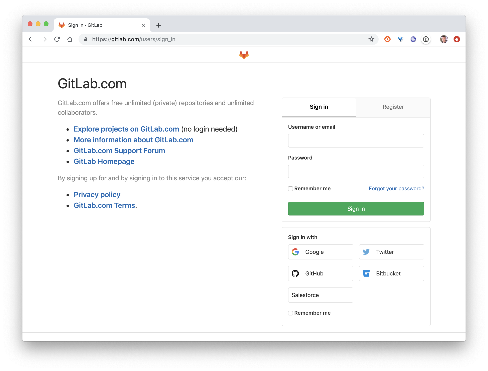

2. Créez un projet

> Sélectionnez *Public* dans le champ *Visibility*.

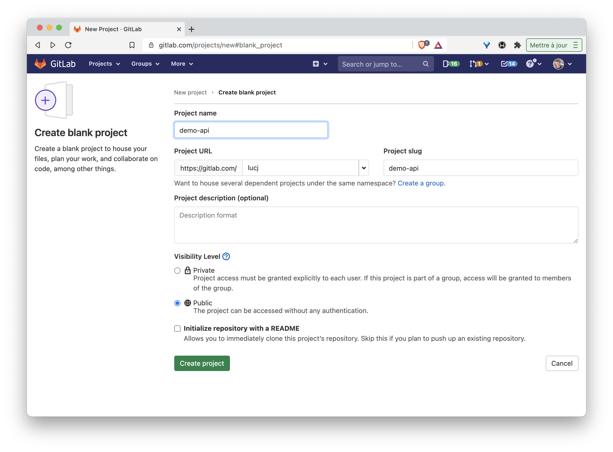

3. Push du code dans GitLab

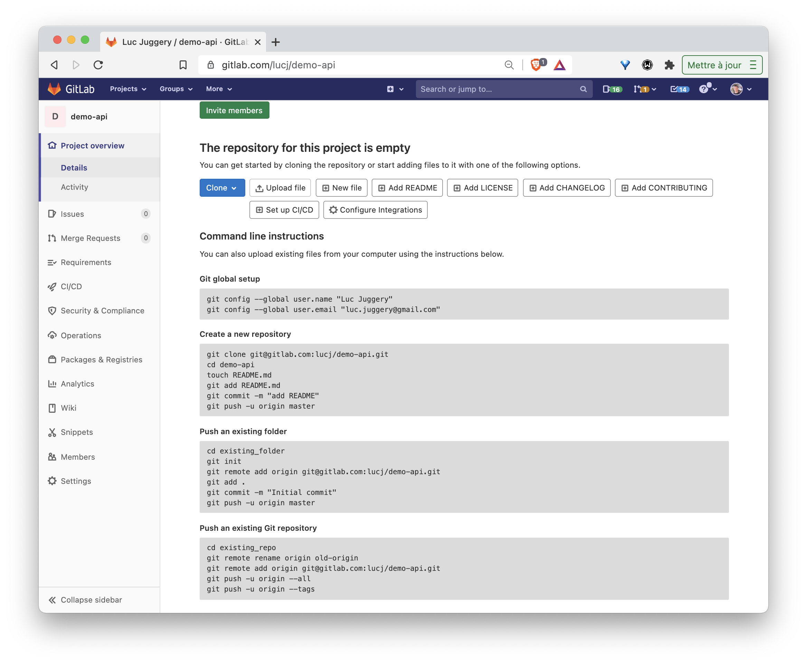

Suivez les instructions présentées dans la section "Push an existing folder" afin de pusher votre project dans ce repository GitLab. Il sera nécessaire de lancer les commandes suivantes depuis le folder *api* créé précedemment:

:fire: assurez-vous de remplacer *GITLAB_USER* par votre nom d'utilisateur sur GitLab

```
git init
git remote add origin git@gitlab.com:GITLAB_USER/demo-api.git
git add .
git commit -m "Initial commit"
git push -u origin master
```

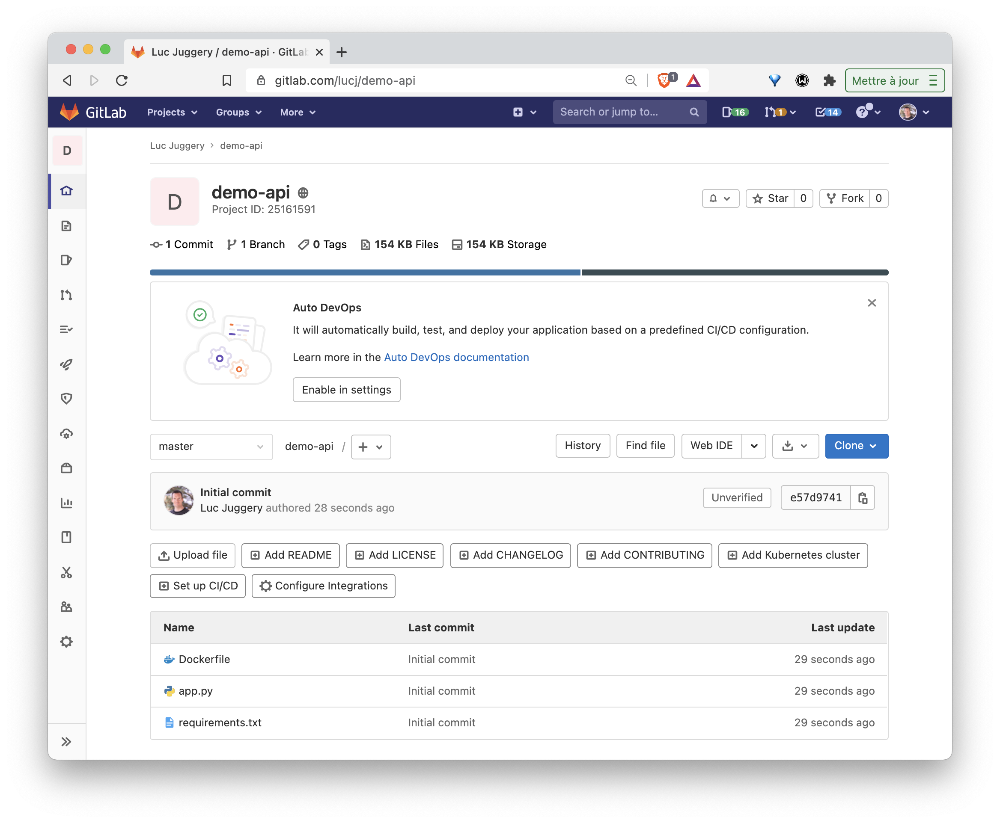

### 2.2. Mise en place d'un pipeline d'intégration continue

Créez un fichier `.gitlab-ci.yml` à la racine de votre projet et assurez vous qu'il contienne les instructions suivantes:

```
stages:
  - package

push image docker:
  image: docker:stable
  stage: package
  services:
    - docker:18-dind
  script:
    - docker build -t $CI_REGISTRY_IMAGE:latest .
    - docker login -u gitlab-ci-token -p $CI_BUILD_TOKEN $CI_REGISTRY
    - docker push $CI_REGISTRY_IMAGE:latest
```

Ces instructions définissent un *stage* nommé *package* contenant les commandes servant à créer une image Docker et à envoyer celle-ci dans le registry GitLab. Commitez l'ajout de ce fichier et envoyez ces changements sur GitLab:

```
$ git add .gitlab-ci.yml
$ git commit -m 'Add GitLab pipeline'
$ git push origin master
```

Depuis le menu *CI / CD* de l'interface de GitLab, vérifiez que la pipeline a été déclenchée.

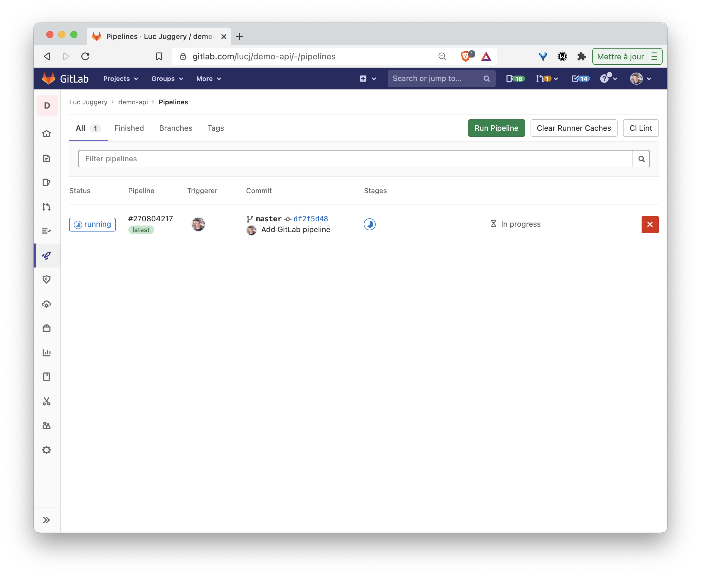

Une fois que cette pipeline est terminée, allez dans le menu *Packages -> Container Registry* et vérifiez que cette première image est maintenant présente dans le registry.

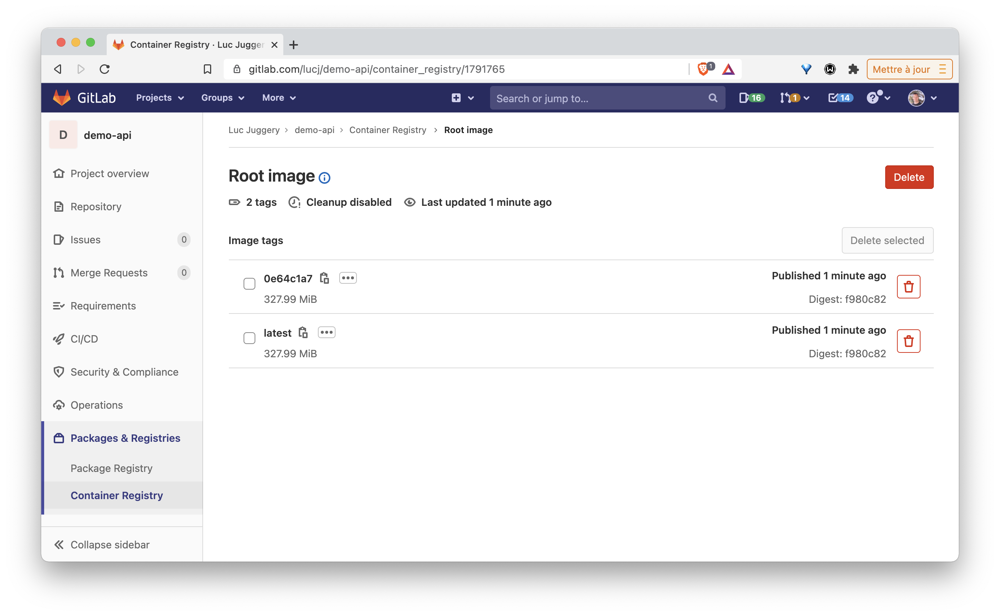

### 2.3. Ajout de tests d'intégration

Dans le fichier `.gitlab-ci.yml`, ajoutez une nouvelle entrée *integration* sous la clé *stage*.

```
stages:
  - package
  - integration
```

A la fin du fichier, ajoutez le step *integration test* suivant:

```
integration test:
  image: docker:stable
  stage: integration
  services:
    - docker:18-dind
  script:
    - docker run -d --name myapp $CI_REGISTRY_IMAGE:latest
    - sleep 10s
    - TEST_RESULT=$(docker run --link myapp lucj/curl -s http://myapp:8000)
    - echo $TEST_RESULT
    - $([ "$TEST_RESULT" == "Hello World!" ])
```

Ce step définit un test de l'image créée. Il vérifie que la chaine "Hello World!" est retournée.

Envoyez ces modifications dans le repository GitLab:

```
$ git add .gitlab-ci.yml
$ git commit -m 'Add integration step'
$ git push origin master
```

Depuis l'interface GitLab, vérifiez que la pipeline est déclenchée.

Vous devriez voir que l'étape *integration* a terminé en erreur.

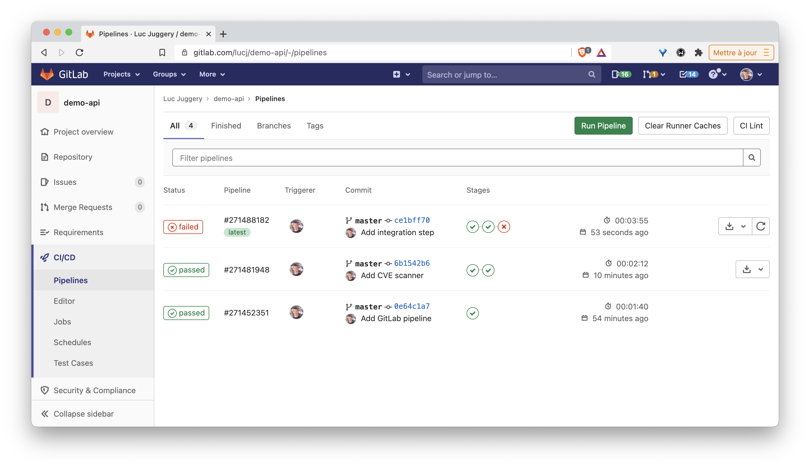

Regardez dans les logs du job, corrigez le code, commitez et pushez les changements. Vérifiez ensuite que le job passe correctement cette fois ci.

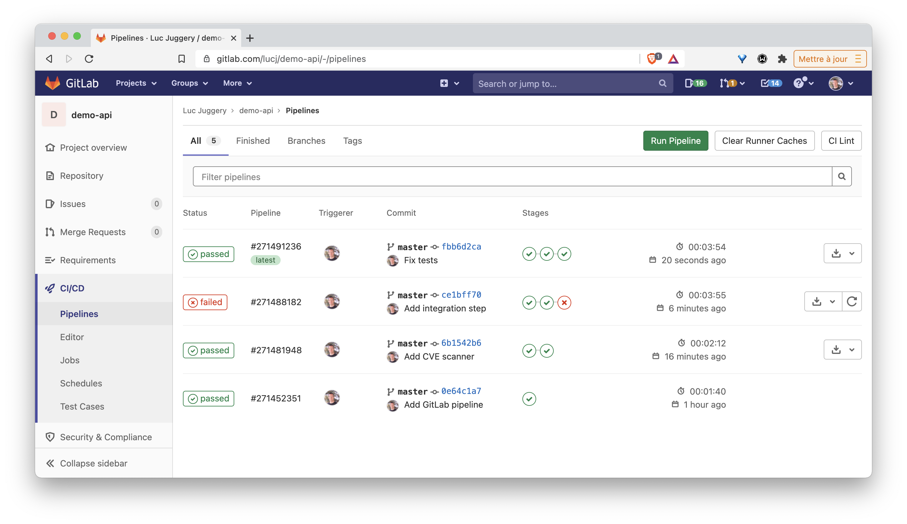

### 2.4. Déploiement automatique

Depuis le menu *Operations > Environments*, créez un environment `test`.

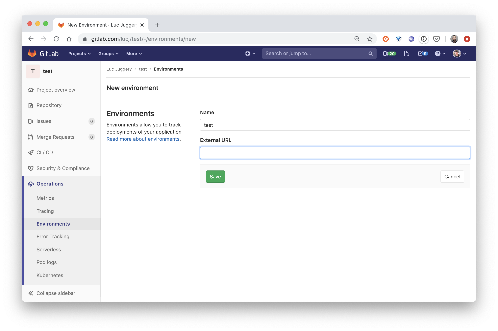

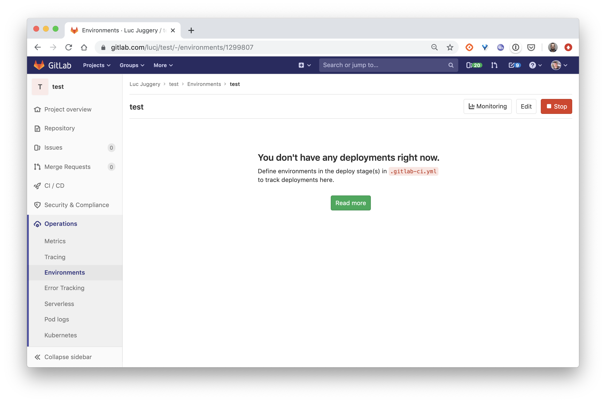

Dans le fichier `.gitlab-ci.yml` ajoutez une nouvelle entrée nommée *deploy* sous la clé *stages*:

```
stages:
  - package
  - integration
  - deploy
```

A la fin du fichier, ajoutez les instructions suivantes:

```
deploy test:
  stage: deploy
  script:
    - echo "Deploy to test server"
  environment:
    name: test
```

Envoyez cette mise à jour sur GitLab puis vérifiez que la pipeline est déclenchée.

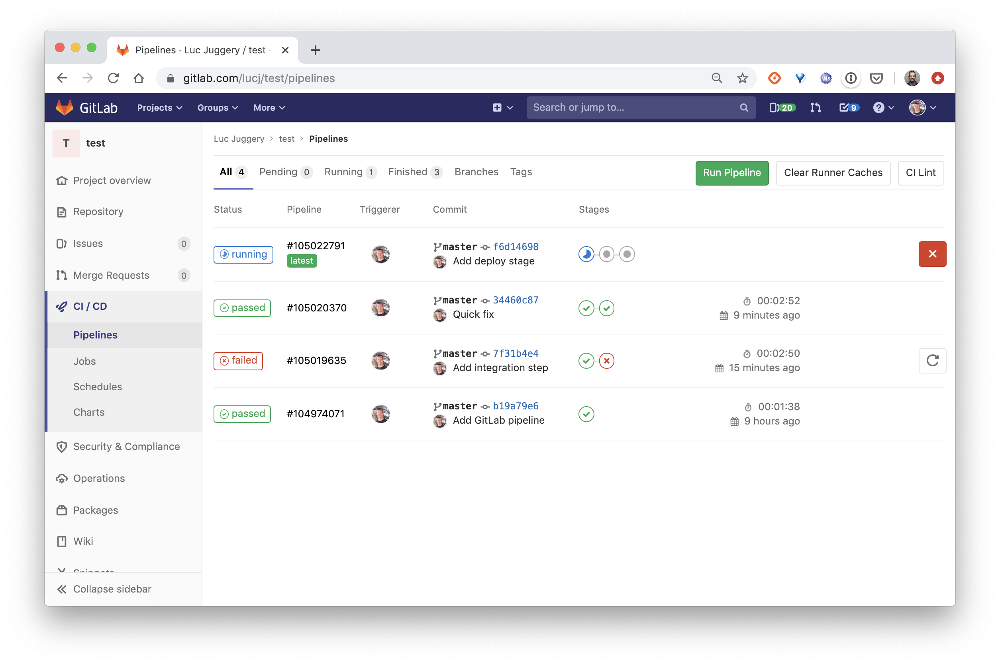

Une fois la pipeline terminée, vous pourrez voir qu'un nouveau déploiement est présent:

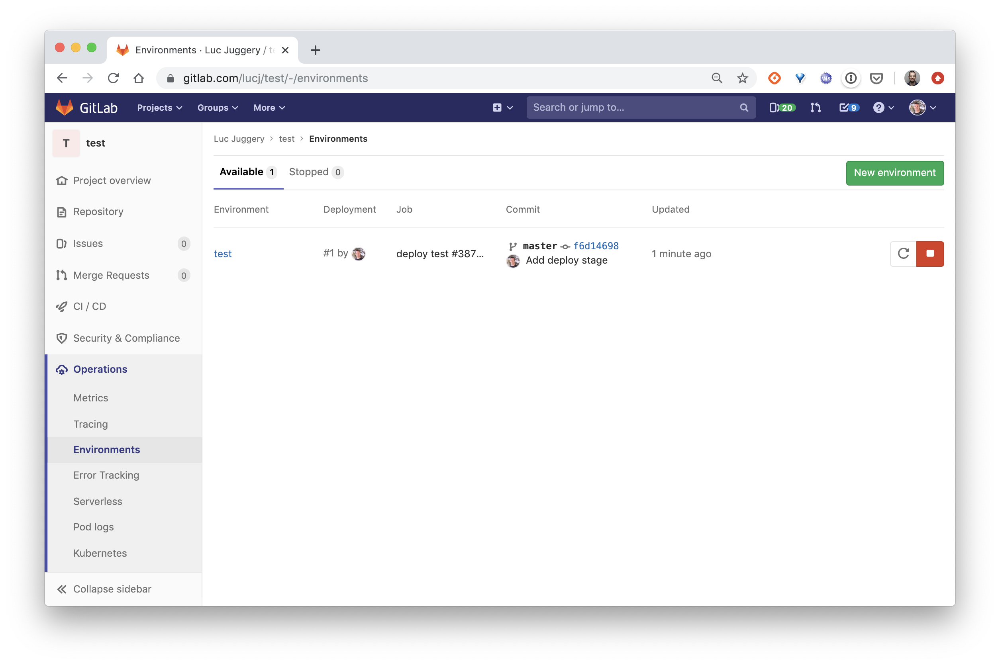

Celui-ci ne fait pas grand chose car nous n'avons pas encore défini les étapes nécessaires afin de déployer l'image qui a été créée. Dans la prochaine étape, vous allez déployer votre serveur sur un cluster Kubernetes.

---

### 3. Intégrez un cluster Kubernetes au repository GitLab

#### 3.1. Mise en place d'un cluster

#### 1er cas

Si vous avez accès déjà accès à un cluster existant accessible via internet, vous pouvez passer à la section 3.2 qui suit.

#### 2ème cas

Vous n'avez pas encore de cluster, la procédure si dessous vous permettra de mettre en place un cluster k3s très facilement.

##### Mise en place d'une Machine virtuelle

Si vous faites cet exercice dans le cadre d'un workshop ou d'un training les éléments suivants vous seront donnés:
- l'adresse IP d'une machine virtuelle créée sur un cloud provider
- une clé ssh pour vous y connecter

Dans le cas contraire, si vous ne faite pas cet exercice dans le cas d'un workshop / training, vous devrez créer une machine virtuelle accessible depuis internet. Vous pourrez par exemple la créer sur [DigitalOcean](https://digitalocean.com), [Civo](https://civo.com), [OVH](https://www.ovh.com/fr/vps/), ... vous n'aurez besoin d'une machine puissante, la version de base suffira.

Lancez un shell sur cette machine virtuelle (en remplaçant le chemin d'accès de la clé privée ainsi que l'adresse IP de votre machine)

```
$ ssh -i PATH_TO_PRIVATE_KEY USERNAME@NODE_IP_ADDRESS
```

##### Installation de K3s

Vous allez maintenant installer [k3s.io](https://k3s.io), une distribution Kubernetes trèe light créée par [Rancher](https://rancher.com/). Depuis le shell précédent, lancez la commande suivante:

```
root@node1:~# curl -sfL https://get.k3s.io | sh -
```

L'installation ne devrait prendre que quelques dizaines de secondes. Vérifiez ensuite la liste des nodes de votre cluster avec la commande suivante:

```
root@node1:~# kubectl get node
```

Vous devriez obtenir un résultat similaire à celui ci-dessous, indiquant que le seul node du cluster est fonctionnel:

```
NAME      STATUS   ROLES    AGE   VERSION
node1     Ready    master   17s   v1.20.4+k3s1
```

Vous avez maintenant une cluster K3s fonctionnel.

Récupérez ensuite le fichier de configuration du cluster, celui-ci est présent dans `/etc/rancher/k3s/k3s.yaml` sur la machine distante:

Note: remplacez le chemin d'accès de la clé privée ainsi que l'adresse IP de votre machine

```
$ scp -i PATH_TO_PRIVATE_KEY root@NODE_IP_ADDRESS:/etc/rancher/k3s/k3s.yaml k3s.yaml-tmp
```

Dans ce fichier remplacez l'adresse IP local avec l'IP de la machine distante:

```
$ cat k3s.yaml-tmp | sed 's/127.0.0.1/NODE_IP_ADDRESS/' > k3s.yaml
```

Positionnez ensuite la variable d'environnement *KUBECONFIG* de façon à ce qu'elle référence le fichier `k3s.yaml`:

```
$ export KUBECONFIG=$PWD/k3s.yaml
```

Depuis votre machine locale, vous devriez maintenant pouvoir communiquer avec le cluster Kubernetes:

```
$ kubectl get nodes
NAME     STATUS   ROLES    AGE   VERSION
node1    Ready    master   5m    v1.20.4+k3s1
```

### 3.2. Intégration du cluster avec votre repository GitLab

Depuis le menu *Operations > Kubernetes* de l'interface GitLab, selectionnez *Add existing cluster*.

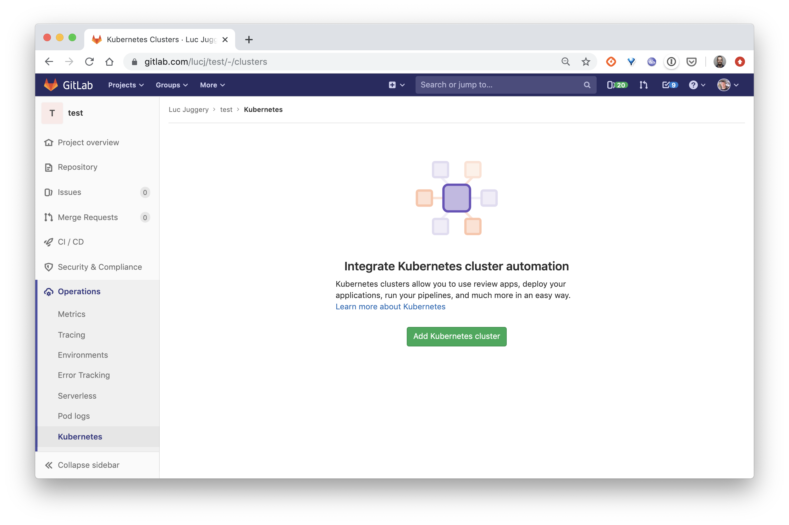

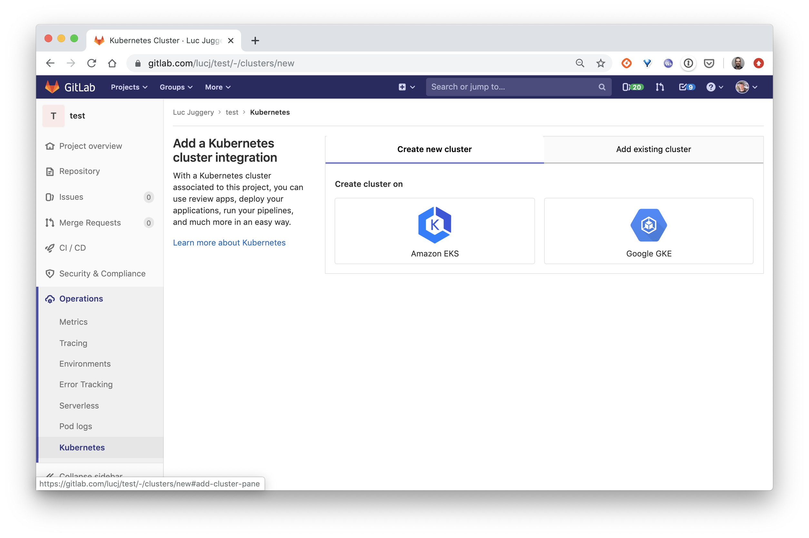

Afin d'intégrer, dans le projet GitLab, le cluster *k3s* que vous avez mis en place précédemment, vous allez suivre les étapes ci-dessous:

- installez *jq* sur votre machine locale. *jq* est un utilitaire très pratique (et très utilisé) pour manipuler les structures json, il peut être installé depuis [jq](https://stedolan.github.io/jq/download/).

- ensuite, depuis le terminal dans lequel vous avez défini la variable d'environnement *KUBECONFIG*, executez la commande suivante:

```
$ curl -O https://luc.run/kubeconfig.sh
$ chmod +x kubeconfig.sh
$ ./kubeconfig.sh
```

Vous obtiendrez les informations nécessaires pour l'intégration de votre cluster Kubernetes dans votre projet GitLab:
- le nom du cluster (vous êtes libre de changer celui-ci si vous le souhaitez)
- l'URL de l'API Server
- l'authorité de certification du cluster
- un token d'authentification

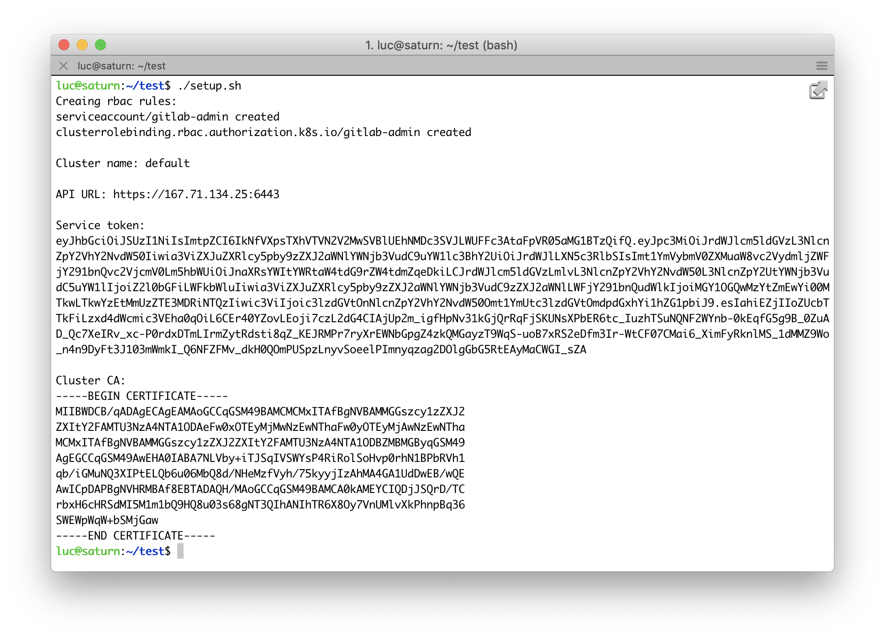

- entrez ces informations dans les champs qui correspondent et assurez vous d'avoir déselectionnez la checkbox *GitLab-managed cluster*

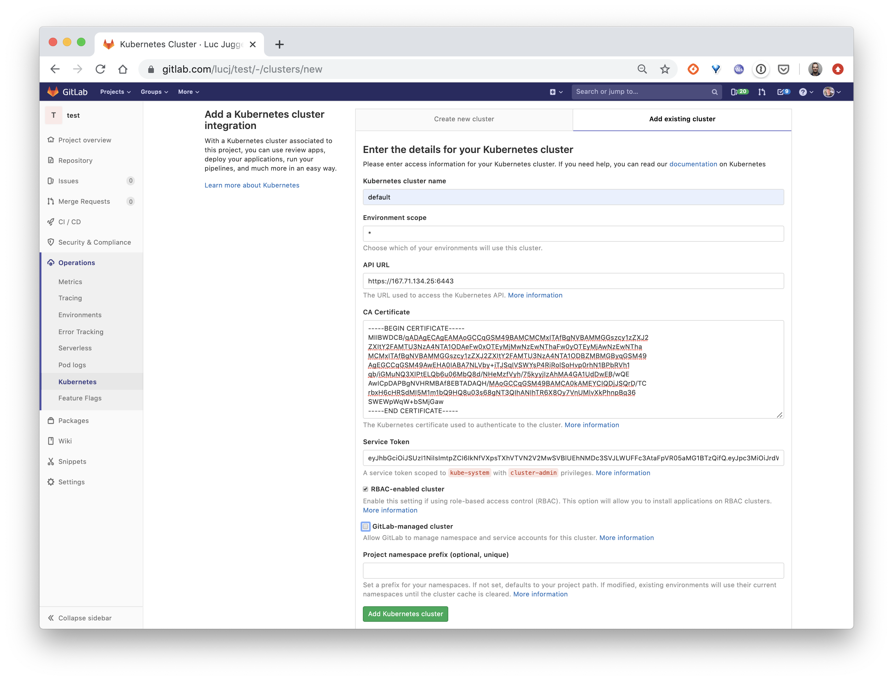

Une fois le formulaire validé, votre projet GitLab sera pourra communiquer avec votre cluster Kubernetes.

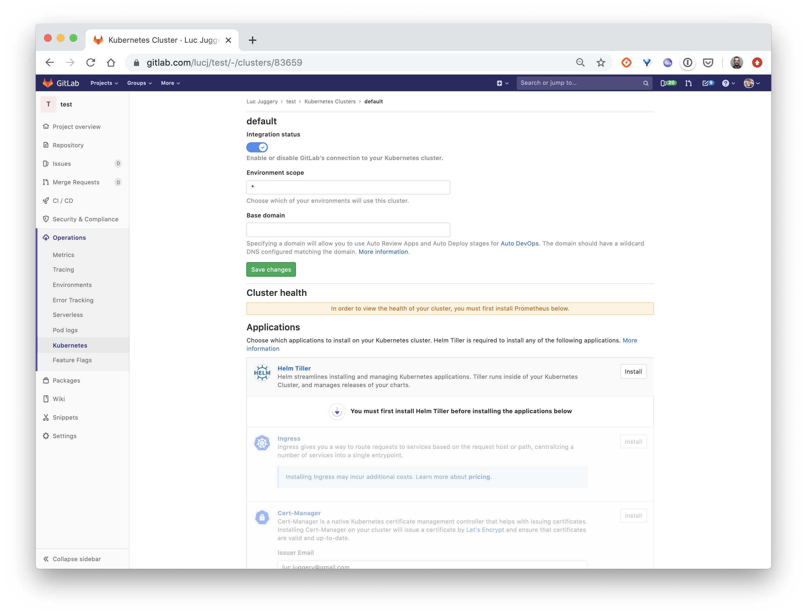

#### 3.5. Ajout des fichiers de spécifications

A la racine de votre projet, copiez le contenu suivant dans le fichier `deploy.yml`.

> Note: remplacez GITLAB_USER avec votre nom d'utilisateur GitLab et REPOSITORY avec le nom de votre projet sur GitLab

```
apiVersion: apps/v1
kind: Deployment
metadata:
  name: www
  labels:
    app: www
spec:
  selector:
    matchLabels:
      app: www  
  replicas: 2
  template:
    metadata:
      labels:
        app: www
    spec:
      containers:
      - name: www
        image: registry.gitlab.com/GITLAB_USER/GITLAB_PROJECT:latest
        imagePullPolicy: Always
```

Au même endroit, placez le contenu suivant dans un fichier `service.yml`.

```
apiVersion: v1
kind: Service
metadata:
  name: www
spec:
  type: NodePort
  ports:
    - name: www
      nodePort: 31000
      port: 80
      targetPort: 8000
      protocol: TCP
  selector:
    app: www
```

Lancez les commandes suivantes afin de déployer l'application dans le cluster:

```
$ kubectl apply -f deploy.yml
$ kubectl apply -f service.yml
```

Assurez vous que les ressources ont été créées correctement:

```
$ kubectl get deploy,pod,svc
```

Vous devriez obtenir un résultat similaire à celui ci-dessous:

```
NAME                  READY   UP-TO-DATE   AVAILABLE   AGE
deployment.apps/www   2/2     2            2           23s

NAME                       READY   STATUS    RESTARTS   AGE
pod/www-658799b784-bsrfl   1/1     Running   0          23s
pod/www-658799b784-b2vwr   1/1     Running   0          23s

NAME                 TYPE        CLUSTER-IP     EXTERNAL-IP   PORT(S)        AGE
service/kubernetes   ClusterIP   10.43.0.1      <none>        443/TCP        7h12m
service/www          NodePort    10.43.76.116   <none>        80:31000/TCP   20s
```

En utilisant l'adresse IP de la VM dans laquelle tourne kubernetes, vérifiez que le serveur web est disponible sur le port 31000.

Note: l'adresse IP peut également être obtenue avec la commande suivante: ```$ kubectl get node -o wide```

```
$ curl http://NODE_IP_ADDRESS:31000
Hello World!
```

### 3.6. Mise en place du deployment automatique

Dans le fichier *.gitlab-ci.yml* modifiez l'étape `deploy test` avec les instructions suivantes:

```
deploy test:
  stage: deploy
  environment: staging
  image: lucj/kubectl:1.20.4
  script:
    - kubectl rollout restart deploy/www
  only:
    kubernetes: active
```

Les instructions définies sous la clé *script* permettent de mettre à jour le Deployment

Note: l'image utilisée (*lucj/kubectl:1.20.4*) contient seulement le binaire *kubectl* dont nous avons besoin dans le pipeline d'intégration continue afin de communiquer avec le cluster

Pour vérifiez qu'un changement dans le code du serveur déclenche une mise à jour de l'application, effectuez les modifications suivantes:
- changez la chaine de caractères retournée par le serveur en "Hello!"
- modifiez le test présent dans *.gitlab-ci.yml*

Publiez les changements dans GitLab. Puis, une fois que la pipeline est terminée, testez une nouvelle fois l'application.

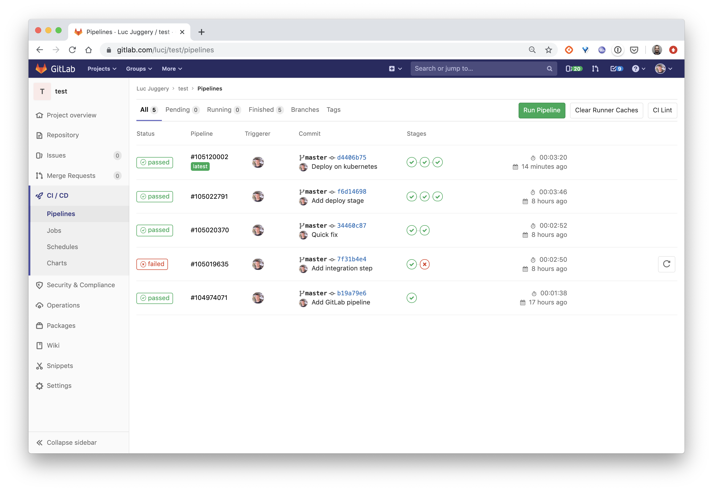

```
$ curl http://NODE_IP_ADDRESS:31000
Hello!
```
