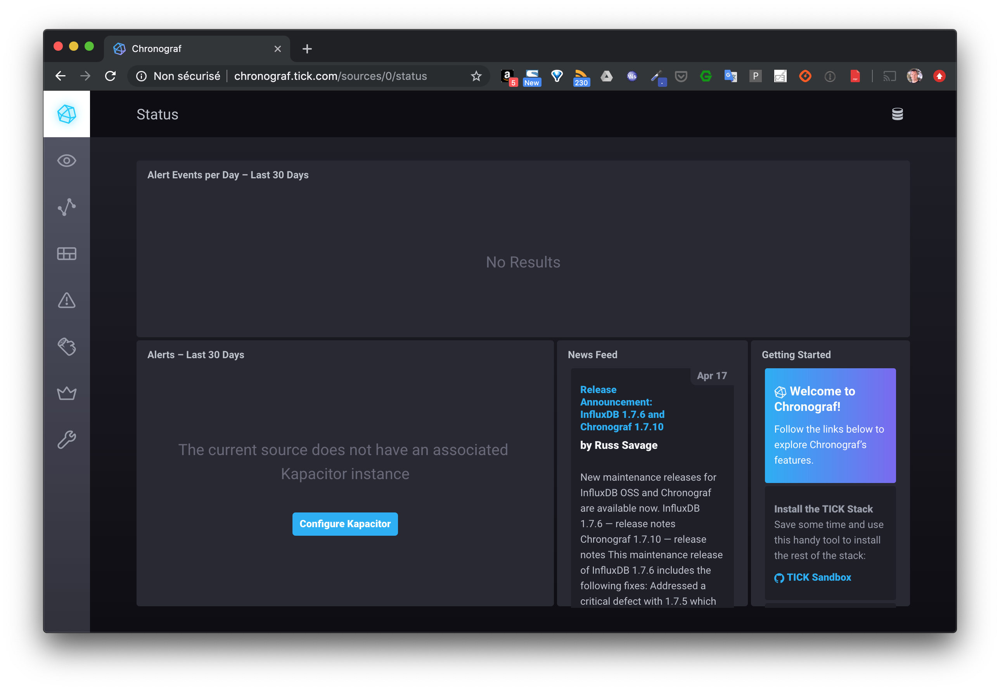
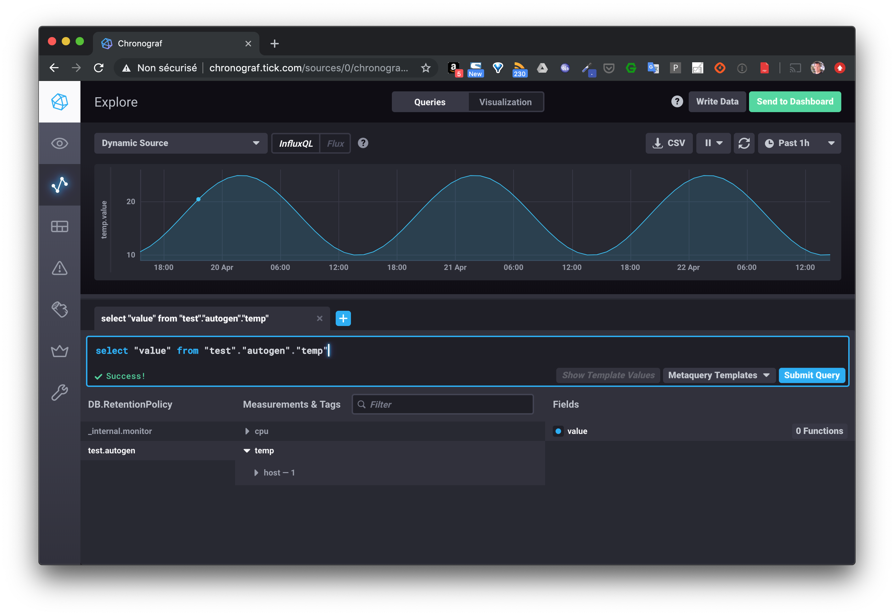

Le but de cet exercice est de packager une stack TICK dans un chart Helm. Cela permettra tout d'abord de présenter cette stack applicative et surtout de voir les étapes nécessaires pour le packaging d'une application. Etapes que vous pourrez suivre par la suite pour packager vos propres applications.

## 1. La stack TICK

Cette stack applicative est utilisée pour la gestion des séries temporelles. C'est par exemple un bon candidat pour les projets IoT dans lesquels des capteurs envoient des données (temperature, pression atmosphérique, ...) en continu.

Son nom vient des différents éléments dont elle est composée:

- Telegraf
- InfluxDB
- Chronograf
- Kapacitor

Le schema suivant illustre l'architecture globale:


Les données sont envoyées à *Telegraf*, et stockées dans un base de données *InfluxDB*. *Chronograf* permet de faire des queries via une interface web. *Kapacitor* est un moteur qui permet de traiter ces données en temps réel et par exemple de lever des alertes basées sur l'évolution de celles-ci.

## 2. Fichiers manifests

L'archive *manifests.tar*, disponible à l'adresse [https://github.com/yahya-j/Kubernetes-Learning/blob/master/Helm/tick/manifests](https://github.com/yahya-j/Kubernetes-Learning/blob/master/Helm/tick/manifests), contient l'ensemble des spécifications nécessaires pour déployer cette stack dans un cluster kubernetes:

- un *Service* et un *Deployment* pour chaque composant (*Telegraf*, *Influxdb*, *Chronograf*, *Kapacitor*)
- une *ConfigMap* contenant la configuration de *Telegraf*
- une ressource *Ingress* pour exposer les différents services:
  - le service *telegraf* sera exposé via *telegraf.tick.com*
  - le service *chronograf* sera exposé via *chronograf.tick.com*


Le répertoire *tick* contiendra alors un répertoire *manifests* avec les fichiers suivants:

```
$ cd tick
$ tree manifests
manifests
├── configmap-telegraf.yaml
├── deploy-chronograf.yaml
├── deploy-influxdb.yaml
├── deploy-kapacitor.yaml
├── deploy-telegraf.yaml
├── ingress.yaml
├── service-chronograf.yaml
├── service-influxdb.yaml
├── service-kapacitor.yaml
└── service-telegraf.yaml
```

## 3. Installation d'un Ingress controller

Un Ingress controller est nécessaire afin d'exposer les services à l'extérieur du cluster via des ressources de type *Ingress*.

:fire: si vous avez déjà un *Ingress Controller* dans votre cluster (même si vous ne l'avez pas installé avec *Helm), vous pouvez passer à l'étape 4.

Si vous n'avez pas de Ingress Controlleur, vous allez à présent l'installer en temps que Chart Helm.

Pour cela, assurez-vous d'avoir installé le client *helm* (dans la version 3.x.y) et lancez les commandes suivantes:

```
$ helm repo add ingress-nginx https://kubernetes.github.io/ingress-nginx
$ helm repo add stable https://charts.helm.sh/stable
$ helm repo update
$ helm install ingress ingress-nginx/ingress-nginx
```

A l'aide de la commande suivante, vérifiez que le Pod dans lequel tourne le Ingress Controller est correctement démarré:

Attention, cette commande ne vous rendra pas la main, vous pourrez la stopper dès que le Pod présentera *1/1* dans la colonne *READY* et *Running* dans la colonne *STATUS*:

```
$ kubectl get pods --watch
NAME                                        READY   STATUS    RESTARTS   AGE
ingress-nginx-controller-855bd8cb4c-6gn5l   1/1     Running   0          49s
```

## 4. Test de l'application

### Création

Placez vous dans le répertoire *tick* et créez les différentes ressources présentes dans le répertoire *manifests*:

```
$ kubectl apply -f manifests
```

Vérifiez ensuite que la création s'est déroulée correctement en lançant la commande suivante:

```
$ kubectl get deploy,po,svc,ingress
```

Vous devriez obtenir un résultat proche de celui ci-dessous:

```
NAME                         READY   UP-TO-DATE   AVAILABLE   AGE
deployment.apps/chronograf   1/1     1            1           38s
deployment.apps/influxdb     1/1     1            1           38s
deployment.apps/kapacitor    1/1     1            1           38s
deployment.apps/telegraf     1/1     1            1           38s

NAME                              READY   STATUS    RESTARTS   AGE
pod/chronograf-868b4b665b-5xlw8   1/1     Running   0          38s
pod/influxdb-7f98cb47dc-d2tlg     1/1     Running   0          38s
pod/kapacitor-f65dd777c-xwgdx     1/1     Running   0          38s
pod/telegraf-54c7f75f6f-pk7xf     1/1     Running   0          38s

NAME                 TYPE        CLUSTER-IP       EXTERNAL-IP   PORT(S)    AGE
service/chronograf   ClusterIP   10.245.205.66    <none>        8888/TCP   38s
service/influxdb     ClusterIP   10.245.158.139   <none>        8086/TCP   37s
service/kapacitor    ClusterIP   10.245.65.240    <none>        9092/TCP   37s
service/kubernetes   ClusterIP   10.245.0.1       <none>        443/TCP    121m
service/telegraf     ClusterIP   10.245.151.236   <none>        8186/TCP   37s

NAME                      CLASS    HOSTS                                   ADDRESS   PORTS   AGE
ingress.extensions/tick   <none>   telegraf.tick.com,chronograf.tick.com             80      38s
```

### Configuration du point d'entrée

- 1er cas

Si votre cluster est déployé chez un cloud provider qui supporte les services de type *LoadBalancer*, un composant load-balancer sera automatiquement créé sur l'infrastructure et il faudra utiliser l'adresse IP externe de ce dernier afin d'envoyer des requêtes HTTP à l'application.

La commande suivante vous permettra d'obtenir l'adresse IP de ce LoadBalancer:


:fire: attention, il vous faudra préciser le namespace *ingress-nginx* si vous n'avez pas installé le Ingress Controller dans le namespace *default* 

```
$ kubectl get svc
NAME                                       TYPE         CLUSTER-IP    EXTERNAL-IP    PORT(S)                    AGE
ingress-ingress-nginx-controller           LoadBalancer 10.245.40.95  157.245.28.245 80:32461/TCP,443:31568/TCP 6m34s
ingress-ingress-nginx-controller-admission ClusterIP    10.245.67.139 <none>         443/TCP                    6m34s
```

Dans l'exemple ci-dessus, l'IP externe est *157.245.28.245*, elle est obtenue dans le champ *EXTERNAL_IP* du service *ingress-ingress-nginx-controller* (présent dans le namespace *ingress-nginx*).

Pour cet exercice, il vous faudra mettre à jour le fichier */etc/hosts* de votre machine local de façon à ce que les sous-domaines *telegraf.tick.com* et *chronograf.tick.com* soient résolus vers cette adresse IP.

Dans l'exemple ci-dessus, j'ai ajouté les entrées suivantes dans le fichier */etc/hosts*:

```
157.245.28.245    telegraf.tick.com
157.245.28.245    chronograf.tick.com
```

- 2nd cas

si vous utilisez *minikube*, vous n'aurez pas d'adresse IP dédiée, il vous faudra mettre à jour le fichier */etc/hosts* avec l'IP de la VM de *minikube*. Si l'adresse IP de minikube est *192.168.99.100*, le fichier */etc/hosts/* devra avoir les entrées suivantes:

```
192.168.99.100   telegraf.tick.com
192.168.99.100   chronograf.tick.com
```

### Accès à l'application

Dépuis un navigateur, vous pourrez accèder à l'interface de *chronograf* depuis l'URL *http://chronograf.tick.com*



### Envoi des données de test

En utilisant les instructions suivantes, vous allez générer des données fictives, simulant une distribution sinusoïdale de la température, et les envoyer à la stack *tick* via le endpoint exposé par *Telegraf*.

- Génération des données

Vous lancerez pour cela un Pod basé sur l'image *lucj/genx* auquel vous donnerez quelques paramètres supplémentaires:

```
$ kubectl run data --restart=Never --image=lucj/genx:0.1 -- -type cos -duration 3d -min 10 -max 25 -step 1h
```

- Après quelques secondes, assurez-vous que le pod lancé précédemment est dans le status *Completed*:

```
$ kubectl get pod data
NAME   READY   STATUS      RESTARTS   AGE
data   0/1     Completed   0          10s
```

- Envoi des données

La commande suivante récupère les données générées et les envoie à *Telegraf*:

```
kubectl logs data | while read line; do
  ts="$(echo $line | cut -d' ' -f1)000000000"
  value=$(echo $line | cut -d' ' -f2)
  curl -is -XPOST http://telegraf.tick.com/write --data-binary "temp value=${value} ${ts}"
done
```

Note: vous devriez obtenir une succession de status *204* indiquant que l'ensemble des données ont été correctement reçues

Vous pouvez alors visualiser ces données en utilisant la query ```select "value" from "test"."autogen"."temp"``` depuis le menu *Explore* de l'interface web de *Chronograf*.




### Cleanup

Supprimez l'application avec la commande suivante:

```
$ kubectl delete -f manifests
```

Vous allez maintenant packager cette application dans un chart HELM.

## 5. Création d'un chart Helm

Toujours depuis le répertoire *tick*, utilisez la commande suivante afin de créer un Chart nommé *tick_chart*.

```
$ helm create tick_chart
```

Par défaut, celui-ci contient principalement les éléments suivants:

- un fichier *Chart.yaml* qui définit les metadata du projet,
- un template pour la création d'un Deployment qui gère un Pod unique
- un template pour la création d'un Service afin d'exposer ce Pod à l'intérieur du cluster
- un template pour la création d'une ressource Ingress pour exposer le service à l'extérieur
- un fichier *values.yaml* utilisé pour substituer les placeholders présents dans les templates par des valeurs dynamiques
- un fichier *NOTES.txt* qui donne des informations à la création de la release et lors des mises à jour

```
$ tree tick_chart
tick_chart
├── Chart.yaml
├── charts
├── templates
│   ├── NOTES.txt
│   ├── _helpers.tpl
│   ├── deployment.yaml
│   ├── hpa.yaml
│   ├── ingress.yaml
│   ├── service.yaml
│   ├── serviceaccount.yaml
│   └── tests
│       └── test-connection.yaml
└── values.yaml
```

### Copie des fichiers manifests

La première chose que vous allez faire est de supprimer tous les fichiers contenus dans le répertoire *templates* et d'y copier les fichiers présents dans le répertoire *manifests* (fichiers que nous avons manipulés précédemment).

Supprimez également le contenu du fichier *values.yaml* (mais ne supprimez pas le fichier), le fichier *NOTES.txt* et le répertoire *test*.

```
rm tick_chart/templates/*.yaml
rm -r tick_chart/templates/tests
rm tick_chart/templates/NOTES.txt
cp manifests/*.yaml tick_chart/templates
echo > tick_chart/values.yaml
```

Le répertoire *tick_chart* aura alors le contenu suivant:

```
$ tree tick_chart/
tick_chart/
├── Chart.yaml
├── charts
├── templates
│  ├── _helpers.tpl
│  ├── configmap-telegraf.yaml
│  ├── deploy-chronograf.yaml
│  ├── deploy-influxdb.yaml
│  ├── deploy-kapacitor.yaml
│  ├── deploy-telegraf.yaml
│  ├── ingress.yaml
│  ├── service-chronograf.yaml
│  ├── service-influxdb.yaml
│  ├── service-kapacitor.yaml
│  ├── service-telegraf.yaml
└── values.yaml
```

### Lancement du chart

En utilisant la commande suivante, lancez l'application maintenant packagée dans un chart Helm:

```
$ helm install tick ./tick_chart
```

Vous devriez obtenir un résultat similaire au suivant:

```
NAME: tick
LAST DEPLOYED: Thu Sep 17 13:40:31 2020
NAMESPACE: default
STATUS: deployed
REVISION: 1
TEST SUITE: None
```

Vérifiez ensuite la liste des releases (terminologie Helm) présentes:

```
$ helm ls -A
NAME   	NAMESPACE    	REVISION	UPDATED                              	STATUS  	CHART              	APP VERSION
ingress	ingress-nginx	1       	2020-09-17 11:53:13.172588 +0200 CEST	deployed	ingress-nginx-3.1.0	0.35.0
tick   	default      	1       	2020-09-17 13:40:31.674099 +0200 CEST	deployed	tick_chart-0.1.0   	1.16.0
```

### Test de l'application

Envoyez les données générées précédemment dans la stack qui est maintenant deployée sous la forme d'un chart Helm.

```
kubectl logs data | while read line; do
  ts="$(echo $line | cut -d' ' -f1)000000000"
  value=$(echo $line | cut -d' ' -f2)
  curl -is -XPOST http://telegraf.tick.com/write --data-binary "temp value=${value} ${ts}"
done
```

Une nouvelle fois, visualisez ces données en utilisant la query ```select "value" from "test"."autogen"."temp"``` depuis le menu *Explore* de l'interface web de *Chronograf*.

### Utilisation du templating

L'intérêt d'une application packagée dans un Chart Helm est de faciliter sa distribution et son déploiement notamment en utilisant la puissance des templates.

Dans cet exercice, nous allons faire en sorte de rendre dynamique les tags des différentes images. Pour cela, commencez par modifier le fichier *tick_chart/values.yaml* de façon à ce qu'il ait le contenu suivant (nous allons utiliser la déclinaison *alpine* pour chaque image):

```
telegraf:
  tag: 1.13-alpine
chronograf:
  tag: 1.7-alpine
kapacitor:
  tag: 1.5-alpine
influxdb:
  tag: 1.5-alpine
```

Ensuite, pour chaque fichier de Deployment présent dans *tick_chart/templates*, remplacer le tag de l'image par {{ .Values.COMPOSANT.tag }}, ou COMPOSANT est influxdb, telegraf, chronograf ou kapacitor. Par exemple, le fichier de Deployment de Influxdb sera modifié de la façon suivante:

```
apiVersion: apps/v1
kind: Deployment
metadata:
  name: influxdb
spec:
  selector:
    matchLabels:
      app: influxdb
  template:
    metadata:
      labels:
        app: influxdb
    spec:
      containers:
      - image: influxdb:{{ .Values.influxdb.tag }}
        name: influxdb
```

Toujours depuis le répertoire *tick*, vous pouvez alors mettre à jour la release avec la commande suivante:

```
$ helm upgrade tick tick_chart --values tick_chart/values.yaml
```

Vous devriez obtenir un résultat similaire à celui ci-dessous:

```
Release "tick" has been upgraded. Happy Helming!
NAME: tick
LAST DEPLOYED: Thu Sep 17 13:52:18 2020
NAMESPACE: default
STATUS: deployed
REVISION: 2
TEST SUITE: None
```

Vérifiez ensuite que les Pods sont bien basés sur les nouvelles versions des images.

Par exemple, les commandes suivantes permettent d'obtenir l'image qui est utilisée par le Pod dans lequel tourne *Telegraf*:

- Récupération de la liste des Pods

```
$ kubectl get pod
NAME                          READY   STATUS      RESTARTS   AGE
chronograf-6cb9c64d56-vw97l   1/1     Running     0          13m
data                          0/1     Completed   0          120m
influxdb-64765784c9-gzr49     1/1     Running     0          13m
kapacitor-7cd66b69f-j595b     1/1     Running     0          13m
telegraf-6d84769594-z2p7h     1/1     Running     0          12m
...
```

- récupération de l'image utilisée par le Pod *Telegraf*

```
$ kubectl get pod telegraf-6d84769594-z2p7h -o jsonpath='{ .spec.containers[0].image }'
telegraf:1.13-alpine
```

## En résumé

Nous avons vu ici un exemple simple de l'utilisation du templating, l'important étant de comprendre son fonctionnement. Lorsque vous allez packager vos propres applications dans des Chart Helm, vous allez généralement commencer par utiliser le templating pour des champs simples puis ajouter des éléments de templating de plus en plus complexes (structures conditionnelles, boucles, ...).
