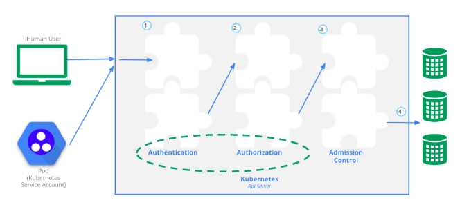
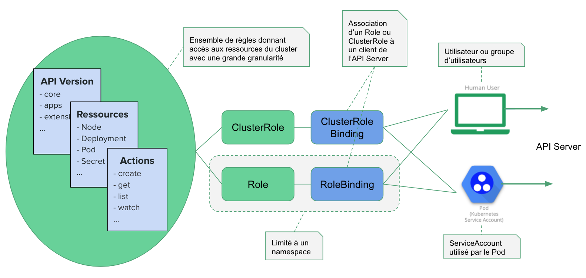

Dans cet exercice vous allez utiliser un certificat x509 pour donner accès à votre cluster à un utilisateur. Vous lui donnerez également les permissions lui permettant de manipuler des Deployments et des Services dans un namespace dédié.

## Prérequis

Pour manipuler des structures JSON depuis la ligne de commande, vous pourrez être amené à utiliser l'utilitaire *jq*. Celui-ci peut être téléchargé depuis [https://stedolan.github.io/jq/](https://stedolan.github.io/jq/)

## Gestion des utilisateurs dans Kubernetes

Lorsque vous utilisez *kubectl* ou l'interface web pour communiquer avec un cluster Kubernetes, des requêtes HTTP sont faites sur les endpoints exposés par l'API Server.

Chaque requête envoyée à l'API Server doit être authentifiée (afin de s'assurer que la personne ou le processus à l'origine de la requête est connu du système) puis être autorisée (afin de s'assurer que l'utilisateur a le droit de réaliser l'action demandée).



Le step d'authentification est effectué au moyen de plugins d'authentication. Plusieurs plugins sont disponibles car il y a différents mécanismes d'authentification possibles:

- Client certificates (the one we will talk about in this post)
- Bearer tokens
- Authenticating proxy
- HTTP basic auth

En fonction du mecanisme utilisé, le plugin correspondant sera en charge de récupérer les information concernant l'utilisateur (humain ou logiciel) à un endroit précis. Par exemple, dans le cadre d'une authentification utilisant un certificat client:

- l'identification de l'utilisateur sera récupéré dans le CN (*CommonName*) du certificat
- les informations concernant le groupe éventuel auquel appartient l'utilisateur seront récupérées dans le champ O (*Organisation*)

Il n'y a pas de ressources User ou Group à l'interieur d'un cluster Kubernetes, ces informations doivent être gérées à l'extérieur du cluster et envoyées avec chaque requête à l'API Server.

## Quelques hypothèses et suppositions

- David, membre de l'équipe *development* a besoin d'avoir un accès à votre cluster

- Votre cluster sera utilisé par plusieurs équipes / clients (approche multi-tenants). Les applications de chaque tenant devront être isolées, vous créerez alors un namespace *development* dédié à l'équipe de David

- David devra manipuler des ressources Kubernetes de type *Deployment* et *Service*. Il devra avoir les droits de création / modification / suppression sur ces ressources, ces droits étant limités au namespace *development*

- Il est probable que les autres membres de l’équipe de David devront avoir le même niveau d’accès ultérieurement. Nous considérerons donc un groupe nommé *dev* et fournirons des droits au niveau de ce groupe si nécessaire

Note: certaines instructions devront être réalisées en tant qu'admin du cluster, certaines  devront  être effectuées en tant que l'utilisateur David. Cela sera spécifié à chaque étape.

## Création d'une clé privée et d'un CSR (Certificate Signin Request)

-- à réaliser en tant que l'utilisateur David --

Créez un répertoire *config/david* dans lequel vous allez générer une clé privée:

```
$ mkdir -p config/david && cd config/david
$ openssl genrsa -out david.key 4096
```

Créez ensuite un csr (Certificat Signin Request), c'est à dire une demande de création de certificat, en utilisant le fichier de configuration suivant (*csr.cnf*):

```
[ req ]
default_bits = 2048
prompt = no
default_md = sha256
distinguished_name = dn

[ dn ]
CN = david
O = dev

[ v3_ext ]
authorityKeyIdentifier=keyid,issuer:always
basicConstraints=CA:FALSE
keyUsage=keyEncipherment,dataEncipherment
extendedKeyUsage=serverAuth,clientAuth
```

Dans ce fichier, le champ *CN* (CommonName) doit contenir l'identificant de l'utilisateur, le champ *O* (Organisation) contient le nom du group de l'utilisateur, ici *dev*.

La création du csr est effectuée avec la commande suivante:

```
$ openssl req -config ./csr.cnf -new -key david.key -nodes -out david.csr
```

Le fichier *david.csr* résultant doit ensuite être envoyé à l'admin du cluster de façon à ce qu'il puisse le signer avec l'authorité de certification du cluster.

## Signature du CSR

-- à réaliser en tant qu'admin du cluster --

Créer le répertoire *config/admin* et placez-y le fichier *david.csr*. Toujours dans ce répertoire, créez le fichier *csr.yml* avec le contenu suivant. Cette spécification sera utilisée pour créer une ressource de type *CertificateSigningRequest*.

:fire: Attention, la ressource *CertificateSigningRequest* est disponible en stable depuis Kubernetes 1.19, la version beta est également disponible mais sera dépréciée à partir de Kubernetes 1.22.

- si vous utilisez une installation de Kubernetes inférieure à la 1.19, vous pourrez utiliser le contenu suivant qui fait référence à la version beta de la ressource *CertificateSigningRequest*

```
apiVersion: certificates.k8s.io/v1beta1
kind: CertificateSigningRequest
metadata:
  name: mycsr
spec:
  groups:
  - system:authenticated
  request: ${BASE64_CSR}
  usages:
  - digital signature
  - key encipherment
  - server auth
  - client auth
```

- si vous utilisez Kubernetes 1.19, vous pourrez utiliser le contenu suivant qui fait référence à la version stable de la ressource *CertificateSigningRequest*

```
apiVersion: certificates.k8s.io/v1
kind: CertificateSigningRequest
metadata:
  name: mycsr
spec:
  groups:
  - system:authenticated
  request: ${BASE64_CSR}
  signerName: kubernetes.io/kube-apiserver-client
  usages:
  - digital signature
  - key encipherment
  - client auth
```

Dans un premier temps, récupérez le contenu de *david.csr*, encodez le en base 64 et placez le résultat dans la variable d'environnement BASE64_CSR:

```
$ export BASE64_CSR=$(cat ./david.csr | base64 | tr -d '\n')
```

Vous pouvez ensuite remplacer cette variable avec sa valeur puis créer la ressource *CertificateSigninRequest* avec la commande suivante:

```
$ cat csr.yml | envsubst | kubectl apply -f -
certificatesigningrequest.certificates.k8s.io/mycsr created
````

Note: cette commande fait appel à l'utilitaire [envsubst](https://www.gnu.org/software/gettext/manual/html_node/envsubst-Invocation.html), très pratique pour la substitution de variable

Une fois la ressource créée, approuvez la avec la commande suivante:

```
$ kubectl certificate approve mycsr
certificatesigningrequest.certificates.k8s.io/mycsr approved
```

Note: cette commande utilise l'authorité de certification du cluster pour signer un certificat basé sur la csr


Depuis la ressource *mycsr*, récupérez le certificat *david.crt* généré:

```
$ kubectl get csr mycsr -o jsonpath='{.status.certificate}' | base64 --decode > david.crt
```

Avec la commande *openssl* suivante, vérifiez le contenu du certificat.

```
$ openssl x509 -in ./david.crt -noout -text
Certificate:
    Data:
        Version: 3 (0x2)
        Serial Number:
            18:af:dc:0b:60:6d:b1:ec:c6:2a:36:1c:06:17:0b:03
    Signature Algorithm: sha256WithRSAEncryption
        Issuer: CN=minikubeCA
        Validity
            Not Before: Oct 15 05:52:14 2020 GMT
            Not After : Oct 15 05:52:14 2021 GMT
        Subject: O=dev, CN=david
        Subject Public Key Info:
            Public Key Algorithm: rsaEncryption
                Public-Key: (4096 bit)
                Modulus:
...
```

Notez la présence du nom de l'utilisateur dans le champ *CN* (CommonName) du sujet, ainsi que le groupe auquel il appartient dans le champ *O* (Organisation). En tant qu'utilisateur David, vous aviez spécifié ces éléments lors de la génération de la csr.

## Création d'un namespace

-- à réaliser en tant qu'admin du cluster --

Afin d'isoler les workloads qui seront déployés par l'utilisateur *David* et les membres du groupe *dev*, créez le namespace nommé *development*. Vous utiliserez ce namespace dans la suite pour y restreindre les droits de l'utilisateur.

```
$ kubectl create ns development
```

## Création de règles RBAC

-- à réaliser en tant qu'admin du cluster --

Rappel: le schéma suivant indique les différentes ressources qui interviennent lors de la mise en place de règles RBAC




Vous allez maintenant définir un role qui servira à donner les droits de gestion des ressources de type *Pod*, *Service* et *Deployment*. Pour ces 2 groupes, nous définissons une liste de ressources et les actions qui doivent être authorisées sur celles-ci.

Note: les ressources *Pod* et *Service* appartiennent à la  version *core* de l'API (la valeur de la clé *apiGroups* est vide dans ce cas), alors que la ressource *Deployment* appartient à la version *apps* de l'API.

Dans le répertoire *config/admin*, copiez le contenu suivant dans le fichier *role.yml*:

```
kind: Role
apiVersion: rbac.authorization.k8s.io/v1
metadata:
 namespace: development
 name: dev
rules:
- apiGroups: [""]
  resources: ["pods", "services"]
  verbs: ["create", "get", "update", "list", "delete"]
- apiGroups: ["apps"]
  resources: ["deployments"]
  verbs: ["create", "get", "update", "list", "delete"]
```

Puis créez la resource avec la commande suivante:

```
$ kubectl apply -f role.yml
```

Avec la ressource *RoleBinding*, vous allez associer le *Role* précédent à l'utilisateur David.
Dans le répertoire *config/admin*, copiez la spécification suivante dans le fichier *rolebinding.yml*

```
kind: RoleBinding
apiVersion: rbac.authorization.k8s.io/v1
metadata:
 name: dev
 namespace: development
subjects:
- kind: User
  name: david
  apiGroup: rbac.authorization.k8s.io
roleRef:
 kind: Role
 name: dev
 apiGroup: rbac.authorization.k8s.io
 ```

Créez ensuite la ressource avec la commande suivante

```
$ kubectl apply -f rolebinding.yml
```

Une fois le RoleBinding créé, si un utilisateur est reconnu comme étant David (via la valeur du champ *CN* dans le certificat utilisé) celui-ci aura les droits définis dans le Role créé précédemment.

Note: vous auriez également pu définir un *RoleBinding* qui associe le *Role* précédent avec le group *dev* comme dans la spécification suivante. En faisant cela, ce role serait associé à chaque utilisateur utilisant un certificat contenant *dev* dans le champ *O* (Organisation)

 ```
apiVersion: rbac.authorization.k8s.io/v1
kind: RoleBinding
metadata:
 name: dev
 namespace: development
subjects:
- kind: Group
  name: dev
  apiGroup: rbac.authorization.k8s.io
roleRef:
 kind: Role
 name: dev
 apiGroup: rbac.authorization.k8s.io
```

### Fichier de configuration

-- à réaliser en tant qu'admin du cluster --

Vous allez maintenant créer le fichier de configuration qui sera utilisé par l'utilisateur David pour se connecter au cluster.

Dans le répertoire *config/admin*, créez le fichier *kubeconfig.tpl* et copiez le contenu suivant dans celui-ci. Vous utiliserez ce template pour créez le fichier de configuration à remettre à l'utilisateur.

```
apiVersion: v1
kind: Config
clusters:
- cluster:
    certificate-authority-data: "${CLUSTER_CA}"
    server: ${CLUSTER_ENDPOINT}
  name: ${CLUSTER_NAME}
users:
- name: ${USER}
  user:
    client-certificate-data: "${CLIENT_CERTIFICATE_DATA}"
contexts:
- context:
    cluster: ${CLUSTER_NAME}
    user: ${USER}
  name: ${USER}-${CLUSTER_NAME}
current-context: ${USER}-${CLUSTER_NAME}
```

Plusieurs variables d'environnement sont utilisées dans ce fichier.

Vous allez commencer par récupérer les valeurs de ces variables à l'aide des instructions suivantes:

- Nom de l'utilisateur
```
$ export USER="david"
```

-  Nom du Cluster (récupéré depuis le context courant)
```
$ export CLUSTER_NAME=$(kubectl config view --minify -o jsonpath={.current-context})
```

- Certificat client
```
$ export CLIENT_CERTIFICATE_DATA=$(kubectl get csr mycsr -o jsonpath='{.status.certificate}')
```

- Authorité de certification du cluster

:fire: Attention, il y a plusieurs cas de figure ici:

  * si vous utilisez *Minikube*, vous pouvez récupérer le cluster CA avec la commande suivante:

```
$ export CLUSTER_CA=$(cat $HOME/.minikube/ca.crt | base64)
```

  * si vous n'utilisez pas Minikube, vous pouvez récupérer le cluster CA avec la commande suivante:

```
$ export CLUSTER_CA=$(kubectl config view --minify --raw -o json | jq -r '.clusters[0].cluster["certificate-authority-data"]')
```

- URL du server d'API du cluster

```
$ export CLUSTER_ENDPOINT=$(kubectl config view --minify --raw -o json | jq '.clusters[0].cluster["server"]')

```

Ces variables peuvent ensuite être substituées dans le fichier de template:

```
$ cat kubeconfig.tpl | envsubst > kubeconfig
```

Le fichier *kubeconfig* résultant peut alors être envoyé à David.

### Utilisation du fichier de configuration

-- à réaliser en tant que l'utilisateur David --

PLacez vous dans Dans le répertoire *config/david*. Copiez le fichier *kubeconfig* puis définissez la variable d'environnement *KUBECONFIG* afin de référencer ce fichier.

```
$ export KUBECONFIG=$PWD/kubeconfig
```

Ajouter ensuite la clé privée dans cette configuration:

```
$ kubectl config set-credentials david \
  --client-key=$PWD/david.key \
  --embed-certs=true
```

Vérifiez alors que vous (en tant que David) avez bien accès au cluster:

```
$ kubectl version
Client Version: version.Info{Major:"1", Minor:"19", GitVersion:"v1.19.3", GitCommit:"1e11e4a2108024935ecfcb2912226cedeafd99df", GitTreeState:"clean", BuildDate:"2020-10-14T18:49:28Z", GoVersion:"go1.15.2", Compiler:"gc", Platform:"darwin/amd64"}
Server Version: version.Info{Major:"1", Minor:"19", GitVersion:"v1.19.2", GitCommit:"f5743093fd1c663cb0cbc89748f730662345d44d", GitTreeState:"clean", BuildDate:"2020-09-16T13:32:58Z", GoVersion:"go1.15", Compiler:"gc", Platform:"linux/amd64"}
```

Essayez de lister les nodes:

```
$ kubectl get nodes
Error from server (Forbidden): nodes is forbidden: User "david" cannot list resource "nodes" in API group "" at the cluster scope
```

Vous obtiendrez alors un message d'erreur, aucun droit n'ayant été donné à l'utilisateur David par rapport à la gestion des nodes.

Vérifiez ensuite que vous pouvez créer un Deployment et un Service en copiant le contenu suivant dans le fichier *www.yml*

```
apiVersion: apps/v1
kind: Deployment
metadata:
  name: www
  namespace: development
spec:
  replicas: 3
  selector:
    matchLabels:
      app: www
  template:
    metadata:
      labels:
        app: www
    spec:
      containers:
      - name: nginx
        image: nginx:1.14-alpine
        ports:
        - containerPort: 80
---
apiVersion: v1
kind: Service
metadata:
  name: www
  namespace: development
spec:
  selector:
    app: vote
  type: ClusterIP
  ports:
  - port: 80
    targetPort: 80
```

puis en créant ces ressources:

```
$ kubectl apply -f www.yml
deployment.apps/www created
service/www created
```

Vous pourrez aussi vérifier que l'utilisateur David n'a pas les droits permettant de manipuler des ressources dans un namespace autre que *development*. Vous pourrez par exemple essayer de lister les Pod présents dans le namespace *default*.

```
$ kubectl get pods
Error from server (Forbidden): pods is forbidden: User “david” cannot list resource “pods” in API group “” in the namespace “default”
```
