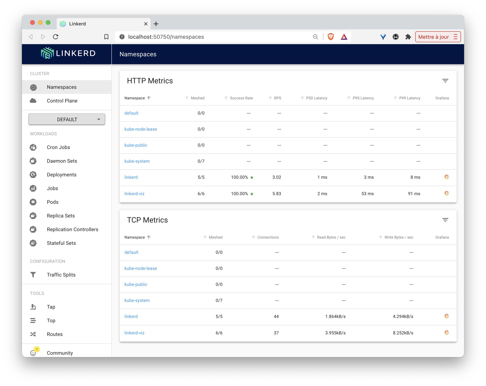

## Objectifs

Le but de cet exercices est de manipuler [Linkerd](https://linkerd.io) une solution de *ServiceMesh* très utilisée.

## Pré-requis

Pour faire cet exercice, il vous suffit d'avoir accès à un cluster Kubernetes. Si c'est déjà le cas, vous pouvez passer à la section suivante.

Si vous n'avez pas de cluster disponible, vous pouvez en créer un rapidement en local en suivant les étapes suivantes:
- installer [Multipass](https://multipass.run)
- lancer les commandes suivantes afin de créer 3 VMs et déployer un cluster k3s sur celles-ci (cela ne prendra que quelques minutes):

### Depuis macOS ou Linux:

Mise en place du cluster:
```
$ curl -O https://github.com/yahya-j/Kubernetes-Learning/blob/master/ServiceMesh/scripts/k3s.sh && chmod +x k3s.sh && ./k3s.sh -c 2 -m 2G -w 2
```

Configuration du client *kubectl* local:
```
$ export KUBECONFIG=$PWD/k3s.cfg
```

### Depuis Windows:

Mise en place du cluster:
```
Invoke-WebRequest -Uri https://github.com/yahya-j/Kubernetes-Learning/blob/master/ServiceMesh/scripts/k3s.ps1 -OutFile k3s.ps1 
.\k3s.ps1 -Cpu 2 -Mem 2G -Workers 2
```

Configuration du client *kubectl* local:
```
$Env:KUBECONFIG="$pwd\kubeconfig.k3s"
```

### Vérification

Assurez-vous ensuite que vous avez accès au cluster, par exemple en listant les nodes:

```
$ kubectl get nodes
NAME    STATUS   ROLES                  AGE   VERSION
k3s-3   Ready    <none>                 6s    v1.20.4+k3s1
k3s-2   Ready    <none>                 12s   v1.20.4+k3s1
k3s-1   Ready    control-plane,master   32s   v1.20.4+k3s1
```

:fire: si vous ne souhaitez pas utiliser la méthode précédente, n'hésitez pas à créer un cluster en utilisant les outils que vous avez l'habitude d'utiliser ou bien en vous reportant aux différents exercices de la section [Installation](https://github.com/yahya-j/Kubernetes-Learning/blob/master/Installation)

## Installation de Linkerd

Lancez les commandes suivantes afin de récupérer les binaires de *Linkerd* et de les mettre à disposition dans votre PATH:

```
$ curl -sL run.linkerd.io/install | sh
$ export PATH=$PATH:$HOME/.linkerd2/bin
```

Vérifiez ensuite la version installée:

```
$ linkerd version
Client version: stable-2.10.0
Server version: unavailable
```

Notes:
- la dernière version en date (mars 2021 est la 2.10)
- linkerd n'a pour le moment pas été installé dans le cluster, raison pour laquelle *Server version* est unavailable

La commande suivante permet de s'assurer que *Linkerd* peut être installé sur le cluster:

```
$ linkerd check --pre
```

Vous devriez obtenir le résultat ci-dessous qui montre que toutes les vérifications sont ok:

```
linkerd check --pre
kubernetes-api
--------------
√ can initialize the client
√ can query the Kubernetes API

kubernetes-version
------------------
√ is running the minimum Kubernetes API version
√ is running the minimum kubectl version

pre-kubernetes-setup
--------------------
√ control plane namespace does not already exist
√ can create non-namespaced resources
√ can create ServiceAccounts
√ can create Services
√ can create Deployments
√ can create CronJobs
√ can create ConfigMaps
√ can create Secrets
√ can read Secrets
√ can read extension-apiserver-authentication configmap
√ no clock skew detected

pre-kubernetes-capability
-------------------------
√ has NET_ADMIN capability
√ has NET_RAW capability

linkerd-version
---------------
√ can determine the latest version
√ cli is up-to-date

Status check results are √
```

A l'aide de la commande suivante, installez à présent les composants du control plane de Linkerd:

```
$ linkerd install | kubectl apply -f -
```

De nombreuses ressources sont créées comme l'illustre le résultat suivant:

```
namespace/linkerd created
clusterrole.rbac.authorization.k8s.io/linkerd-linkerd-identity created
clusterrolebinding.rbac.authorization.k8s.io/linkerd-linkerd-identity created
serviceaccount/linkerd-identity created
clusterrole.rbac.authorization.k8s.io/linkerd-linkerd-controller created
clusterrolebinding.rbac.authorization.k8s.io/linkerd-linkerd-controller created
serviceaccount/linkerd-controller created
clusterrole.rbac.authorization.k8s.io/linkerd-linkerd-destination created
clusterrolebinding.rbac.authorization.k8s.io/linkerd-linkerd-destination created
serviceaccount/linkerd-destination created
role.rbac.authorization.k8s.io/linkerd-heartbeat created
rolebinding.rbac.authorization.k8s.io/linkerd-heartbeat created
clusterrole.rbac.authorization.k8s.io/linkerd-heartbeat created
clusterrolebinding.rbac.authorization.k8s.io/linkerd-heartbeat created
serviceaccount/linkerd-heartbeat created
customresourcedefinition.apiextensions.k8s.io/serviceprofiles.linkerd.io created
customresourcedefinition.apiextensions.k8s.io/trafficsplits.split.smi-spec.io created
clusterrole.rbac.authorization.k8s.io/linkerd-linkerd-proxy-injector created
clusterrolebinding.rbac.authorization.k8s.io/linkerd-linkerd-proxy-injector created
serviceaccount/linkerd-proxy-injector created
secret/linkerd-proxy-injector-k8s-tls created
mutatingwebhookconfiguration.admissionregistration.k8s.io/linkerd-proxy-injector-webhook-config created
clusterrole.rbac.authorization.k8s.io/linkerd-linkerd-sp-validator created
clusterrolebinding.rbac.authorization.k8s.io/linkerd-linkerd-sp-validator created
serviceaccount/linkerd-sp-validator created
secret/linkerd-sp-validator-k8s-tls created
validatingwebhookconfiguration.admissionregistration.k8s.io/linkerd-sp-validator-webhook-config created
podsecuritypolicy.policy/linkerd-linkerd-control-plane created
role.rbac.authorization.k8s.io/linkerd-psp created
rolebinding.rbac.authorization.k8s.io/linkerd-psp created
configmap/linkerd-config created
secret/linkerd-identity-issuer created
service/linkerd-identity created
service/linkerd-identity-headless created
deployment.apps/linkerd-identity created
service/linkerd-controller-api created
deployment.apps/linkerd-controller created
service/linkerd-dst created
service/linkerd-dst-headless created
deployment.apps/linkerd-destination created
cronjob.batch/linkerd-heartbeat created
deployment.apps/linkerd-proxy-injector created
service/linkerd-proxy-injector created
service/linkerd-sp-validator created
deployment.apps/linkerd-sp-validator created
secret/linkerd-config-overrides created
```

Il est ensuite nécessaire de s'assurer que l'ensemble des composants a été correctement créé:

```
$ linkerd check
```

Si tout s'est déroulé correctement, vous devriez obtenir tous les voyants au vert comme dans le résultat ci-dessous:

```
kubernetes-api
--------------
√ can initialize the client
√ can query the Kubernetes API

kubernetes-version
------------------
√ is running the minimum Kubernetes API version
√ is running the minimum kubectl version

linkerd-existence
-----------------
√ 'linkerd-config' config map exists
√ heartbeat ServiceAccount exist
√ control plane replica sets are ready
√ no unschedulable pods
√ controller pod is running

linkerd-config
--------------
√ control plane Namespace exists
√ control plane ClusterRoles exist
√ control plane ClusterRoleBindings exist
√ control plane ServiceAccounts exist
√ control plane CustomResourceDefinitions exist
√ control plane MutatingWebhookConfigurations exist
√ control plane ValidatingWebhookConfigurations exist
√ control plane PodSecurityPolicies exist

linkerd-identity
----------------
√ certificate config is valid
√ trust anchors are using supported crypto algorithm
√ trust anchors are within their validity period
√ trust anchors are valid for at least 60 days
√ issuer cert is using supported crypto algorithm
√ issuer cert is within its validity period
√ issuer cert is valid for at least 60 days
√ issuer cert is issued by the trust anchor

linkerd-webhooks-and-apisvc-tls
-------------------------------
√ proxy-injector webhook has valid cert
√ proxy-injector cert is valid for at least 60 days
√ sp-validator webhook has valid cert
√ sp-validator cert is valid for at least 60 days

linkerd-api
-----------
√ control plane pods are ready
√ can initialize the client
√ can query the control plane API

linkerd-version
---------------
√ can determine the latest version
√ cli is up-to-date

control-plane-version
---------------------
√ control plane is up-to-date
√ control plane and cli versions match

Status check results are √
```

## Visualisation

Depuis la version 2.10, Linkerd permet d'installer des extensions afin de réduire l'utilisation des ressources. Utilisez la commande suivante afin d'installer l'extension *viz* qui mettra en place Prometheus, le dashboard Linkerd ainsi que les composants permettant la gestion des metrics:

```
linkerd viz install | kubectl apply -f -
```

Vérifiez une nouvelle fois que tout a bien été installé, notamment dans la section *Linkerd extensions checks*

```
$ linkerd check
...
Linkerd extensions checks
=========================

linkerd-viz
-----------
√ linkerd-viz Namespace exists
√ linkerd-viz ClusterRoles exist
√ linkerd-viz ClusterRoleBindings exist
√ tap API server has valid cert
√ tap API server cert is valid for at least 60 days
√ tap API service is running
√ linkerd-viz pods are injected
√ viz extension pods are running
√ prometheus is installed and configured correctly
√ can initialize the client
√ viz extension self-check

Status check results are √
```

Une fois l'extension *viz* installé, le dashboard Linkerd est accessible via:

```
linkerd viz dashboard &
```

Cette interface montre les différents éléments présents dans le cluster. Pour le moment, seuls les composants de *Linkerd* font parti du *Mesh* (notés en tant que *Meshed Pods*)




## Emojivoto application

Afin d'illustrer les fonctionnalités de base de *Linkerd*, vous allez installer l'application *emojivoto* (application microservices présentée dans la documentation officielle de *Linkerd*) qui permet de voter entre différents Emojis

### Déploiement de l'application

Utilisez la commande suivante pour créer les différentes ressources de l'application:

```
$ curl -sL https://run.linkerd.io/emojivoto.yml | kubectl apply -f -
namespace/emojivoto created
serviceaccount/emoji created
serviceaccount/voting created
serviceaccount/web created
service/emoji-svc created
service/voting-svc created
service/web-svc created
deployment.apps/emoji created
deployment.apps/vote-bot created
deployment.apps/voting created
deployment.apps/web created
```

Note: un générateur de trafic (*vote-bot*) est également déployé afin d'envoyer régulièrement des requêtes à l'application

### Accès à l'application

Afin d'avoir accès à l'application depuis votre machine locale, utilisez la commande *port-forward* afin d'exposer le service nommé *web-svc*:

```
$ kubectl -n emojivoto port-forward svc/web-svc 8080:80
```

L'application *emojivoto* est alors disponible à l'adresse [http://localhost:8080](http://localhost:8080). Il est donc possible de voter pour son Emoji favori :)


Note: le vote sur certains emojis (par exemple le doughnut) entraînera une erreur, celles-ci ont été introduites volontairement dans l'application


Remarquez alors que le nouveau namespace *emojivoto* est maintenant disponible depuis l'interface web de Linkerd. L'application n'étant pas encore gérée par *Linkerd*, aucun de ces services ne sont encore dans le mesh (colonne *Meshed* de l'interface).


### Gestion de l'application avec Linkerd

Afin d'ajouter les fonctionnalités de *Linkerd* à l'application *emojivoto*, nous allons modifier chaque Pod de l'application de façon à ajouter un nouveau container faisant office de proxy à l'intérieur de chacun d'entre eux. Cette opération se fait facilement au moyen de la commande ci-dessous qui va modifier la spécification de l'ensemble des Deployments du namespace *emojivoto*:

```
$ kubectl get -n emojivoto deploy -o yaml \
  | linkerd inject - \
  | kubectl apply -f -
deployment "vote-bot" injected
deployment "web" injected
deployment "emoji" injected
deployment "voting" injected

deployment.apps/vote-bot configured
deployment.apps/web configured
deployment.apps/emoji configured
deployment.apps/voting configured
```

Les proxy *Linkerd* sont maintenant installés dans chaque microservice de l'application. Nous pouvons le vérifier avec la commande suivante:

```
$ linkerd -n emojivoto check --proxy
kubernetes-api
--------------
√ can initialize the client
√ can query the Kubernetes API

kubernetes-version
------------------
√ is running the minimum Kubernetes API version
√ is running the minimum kubectl version

linkerd-existence
-----------------
√ 'linkerd-config' config map exists
√ heartbeat ServiceAccount exist
√ control plane replica sets are ready
√ no unschedulable pods
√ controller pod is running

linkerd-config
--------------
√ control plane Namespace exists
√ control plane ClusterRoles exist
√ control plane ClusterRoleBindings exist
√ control plane ServiceAccounts exist
√ control plane CustomResourceDefinitions exist
√ control plane MutatingWebhookConfigurations exist
√ control plane ValidatingWebhookConfigurations exist
√ control plane PodSecurityPolicies exist

linkerd-identity
----------------
√ certificate config is valid
√ trust anchors are using supported crypto algorithm
√ trust anchors are within their validity period
√ trust anchors are valid for at least 60 days
√ issuer cert is using supported crypto algorithm
√ issuer cert is within its validity period
√ issuer cert is valid for at least 60 days
√ issuer cert is issued by the trust anchor

linkerd-webhooks-and-apisvc-tls
-------------------------------
√ proxy-injector webhook has valid cert
√ proxy-injector cert is valid for at least 60 days
√ sp-validator webhook has valid cert
√ sp-validator cert is valid for at least 60 days

linkerd-identity-data-plane
---------------------------
√ data plane proxies certificate match CA

linkerd-api
-----------
√ control plane pods are ready
√ can initialize the client
√ can query the control plane API

linkerd-version
---------------
√ can determine the latest version
√ cli is up-to-date

linkerd-data-plane
------------------
√ data plane namespace exists
√ data plane proxies are ready
√ data plane is up-to-date
√ data plane and cli versions match

Status check results are √

Linkerd extensions checks
=========================

linkerd-viz
-----------
√ linkerd-viz Namespace exists
√ linkerd-viz ClusterRoles exist
√ linkerd-viz ClusterRoleBindings exist
√ tap API server has valid cert
√ tap API server cert is valid for at least 60 days
√ tap API service is running
√ linkerd-viz pods are injected
√ viz extension pods are running
√ prometheus is installed and configured correctly
√ can initialize the client
√ viz extension self-check

linkerd-viz-data-plane
----------------------
√ data plane namespace exists
√ data plane proxy metrics are present in Prometheus

Status check results are √
```

### Debugging à l'aide des metrics

Depuis l'interface web de Linkerd, il est alors possible de visualiser différentes metrics. Celles-ci pouvant être utilisées pour mettre en évidence un fonctionnement anormal de l'application et affiner son origine.

Note: ces metrics sont générées par l'ensemble des requêtes envoyées régulièrement par le générateur de trafic déployé avec l'application


Vous pourrez notamment identifier qu'un vote sur l'emoji Doughnut résulte constamment en une erreur.

Linkerd utilise Prometheus pour sauvegarder l'évolution des metrics. Celles-ci peuvent également être visualisées depuis un dashboard Grafana intégré:


### En résumé

En quelques commandes, vous avez donc déployé une application et ajouté celle-ci au Mesh mis en place par Linkerd. Un nouveau container a été ajouté dans chaque Pod de l'application, ce container est un proxy par lequel passe tous les flux entrants et sortants du container applicatif à côté duquel il se trouve. Linkerd permet alors de gérer ce réseau de proxy et notamment d'obtenir des informations sur les flux réseau qui les traversent. Ces informations sont très importantes pour mettre en évidence certains problèmes et aider à les localiser, voire à les résoudre. 

A noter que tout ceci a été effectué sans changer le code source de l'application.

### Cleanup

A l'aide de la commande suivante, supprimez l'application et le namespace associé:

```
$ curl -sL https://run.linkerd.io/emojivoto.yml \
  | kubectl -n emojivoto delete -f -
```

## Book application

Afin d'illustrer les fonctionnalités plus avancées de *Linkerd*, vous allez installer l'application *bookapp* (application microservices présentée dans la documentation officielle de *Linkerd*) qui sert à gérer un ensemble de livres.

Cette application comporte 3 microservices comme l'illustre le schéma suivant:


Note: un générateur de trafic est également déployé afin d'envoyer régulièrement des requêtes à l'application

### Déploiement de l'application

Utilisez la commande suivante pour créer le namespace *bookapp* et les différentes ressources de l'application dans ce namespace:

```
$ kubectl create ns booksapp

$ curl -sL https://run.linkerd.io/booksapp.yml | kubectl -n booksapp apply -f -
```

Vérifiez ensuite que toutes les ressources ont été correctement créées:

```
$ kubectl -n booksapp get all
```

Vous devriez obtenir un résultat similaire à celui ci-dessous:

```
NAME                           READY   STATUS    RESTARTS   AGE
pod/traffic-5b5d84f67d-slfwq   1/1     Running   0          53s
pod/webapp-74f795dc7c-xv5c2    0/1     Running   0          54s
pod/webapp-74f795dc7c-j6khl    0/1     Running   0          54s
pod/webapp-74f795dc7c-k4xq4    0/1     Running   0          54s
pod/books-545c88bfbf-tgsd4     0/1     Running   0          53s
pod/authors-59d7484b9c-7d4k8   1/1     Running   0          54s

NAME              TYPE        CLUSTER-IP     EXTERNAL-IP   PORT(S)    AGE
service/webapp    ClusterIP   10.43.111.86   <none>        7000/TCP   55s
service/authors   ClusterIP   10.43.70.38    <none>        7001/TCP   54s
service/books     ClusterIP   10.43.74.202   <none>        7002/TCP   54s

NAME                      READY   UP-TO-DATE   AVAILABLE   AGE
deployment.apps/webapp    0/3     3            0           55s
deployment.apps/books     0/1     1            0           54s
deployment.apps/traffic   1/1     1            1           53s
deployment.apps/authors   1/1     1            1           54s

NAME                                 DESIRED   CURRENT   READY   AGE
replicaset.apps/webapp-74f795dc7c    3         3         0       54s
replicaset.apps/books-545c88bfbf     1         1         0       53s
replicaset.apps/traffic-5b5d84f67d   1         1         1       53s
replicaset.apps/authors-59d7484b9c   1         1         1       54s
```

### Accès à l'application

Afin d'avoir accès à l'application depuis votre machine locale, utilisez la commande *port-forward* afin d'exposer le service nommé *webapp*:

```
$ kubectl -n booksapp port-forward svc/webapp 7000
```

L'application est alors disponible à l'adresse [http://localhost:7000](http://localhost:7000).


Si vous essayez d'ajouter un livre, vous obtiendrez cependant régulièrement une erreur:


Nous verrons dans une des prochaines sections comment identifier ce problème plus précisément.

Depuis l'interface web de Linkerd, on peut également voir que le namespace *bookapp* a été détecté, mais pour le moment aucun des services n'est présent dans le mesh


### Gestion de l'application avec Linkerd

Afin d'ajouter les fonctionnalités de *Linkerd* à l'application nous allons modifier chaque Pod de l'application de façon à ajouter un nouveau container faisant office de proxy à l'intérieur de chacun d'entre eux, comme nous l'avions fait pour l'application *emojivoto*. Utilisez pour cela la commande suivante:

```
$ kubectl get -n booksapp deploy -o yaml \
  | linkerd inject - \
  | kubectl apply -f -

deployment "traffic" injected
deployment "authors" injected
deployment "webapp" injected
deployment "books" injected

deployment.apps/traffic configured
deployment.apps/authors configured
deployment.apps/webapp configured
deployment.apps/books configured
```

Les proxy *Linkerd* sont maintenant installés dans chaque microservice de l'application. Vous pouvez le vérifier avec la commande suivante:

```
$ linkerd -n booksapp check --proxy
```

Nous pouvons alors voir que les services de l'application sont maintenant présent dans le Mesh:


### Debugging à l'aide de live metrics

Depuis l'interface web de Linkerd, listez les deployments qui sont dans le namespace *bookapp*:


Vous pourrez notamment voir l'évolution des "Success Rates" pour chaque requête envoyée à l'application par le générateur de trafic.

Sélectionnez le deployment *webapp* afin d'obtenir davantage d'informations.


Nous pouvons voir que les requêtes POST sur le endpoint */books.json* du deployment *book* posent problème. Il s'agit de la requête de création d'un livre pour laquelle nous avions observé une erreur précédemment.


 En allant un peu plus loin, vous pourrez voir que cette requête renvoie souvent des erreurs 500.


Dans la suite, nous allons voir comment en savoir plus sur cette erreur.

### Debugging à l'aide de ServiceProfile

Linkerd utilise des ressources de type *ServiceProfile* afin d'obtenir des informations supplémentaires sur les services et notamment des metrics, stockées dans Prometheus, pour chaque endpoint. Un *ServiceProfile* peut être créé manuellement ou bien en utilisant une spécification existante au format OpenAPI (Swagger).

Il existe pour chacun des microservices de l'application *bookapp* une spécification OpenAPI. La commande ci-dessous:
- récupère cette spécification pour le microservice *webapp*
- opère quelques manipulations textuelles sur celle-ci afin de créer une spécification de type *ServiceProfile*
- créé cette ressource dans le cluster

```
$ curl -sL https://run.linkerd.io/booksapp/webapp.swagger \
  | linkerd -n booksapp profile --open-api - webapp \
  | kubectl -n booksapp apply -f -
serviceprofile.linkerd.io/webapp.booksapp.svc.cluster.local created
```

Après avoir lancé cette commande, vérifiez le contenu du *ServiceProfile* ainsi créé:

```
$ kubectl get serviceprofile webapp.booksapp.svc.cluster.local -n booksapp -o yaml
apiVersion: linkerd.io/v1alpha2
kind: ServiceProfile
metadata:
  ...
spec:
  routes:
  - condition:
      method: GET
      pathRegex: /
    name: GET /
  - condition:
      method: POST
      pathRegex: /authors
    name: POST /authors
  - condition:
      method: GET
      pathRegex: /authors/[^/]*
    name: GET /authors/{id}
  - condition:
      method: POST
      pathRegex: /authors/[^/]*/delete
    name: POST /authors/{id}/delete
  - condition:
      method: POST
      pathRegex: /authors/[^/]*/edit
    name: POST /authors/{id}/edit
  - condition:
      method: POST
      pathRegex: /books
    name: POST /books
  - condition:
      method: GET
      pathRegex: /books/[^/]*
    name: GET /books/{id}
  - condition:
      method: POST
      pathRegex: /books/[^/]*/delete
    name: POST /books/{id}/delete
  - condition:
      method: POST
      pathRegex: /books/[^/]*/edit
    name: POST /books/{id}/edit
```

Le nom de ce *ServiceProfile* correspond au FQDN du service. A chaque fois qu'un proxy recevra une requête contenant ce FQDN dans le header *Host*, il utilisera la configuration spécifiée dans le *ServiceProfile* correspondant.

Créez également les ressources de type *ServiceProfile* pour les microservices authors et books:

```
$ curl -sL https://run.linkerd.io/booksapp/authors.swagger \
  | linkerd -n booksapp profile --open-api - authors \
  | kubectl -n booksapp apply -f -
serviceprofile.linkerd.io/authors.booksapp.svc.cluster.local created

$ curl -sL https://run.linkerd.io/booksapp/books.swagger \
  | linkerd -n booksapp profile --open-api - books \
  | kubectl -n booksapp apply -f -
serviceprofile.linkerd.io/books.booksapp.svc.cluster.local created
```

La commande suivante peut être utilisée pour visualiser les requêtes en temps réel (cette commande ne vous rendra pas la main)

```
linkerd viz tap -n booksapp deploy/webapp
```

Afin de voir les metrics accumulées, utilisez la commande suivante:

```
$ linkerd viz -n booksapp routes svc/webapp
```

Vous devriez obtenir un résultat proche de celui ci-dessous:

```
ROUTE                       SERVICE   SUCCESS      RPS   LATENCY_P50   LATENCY_P95   LATENCY_P99
GET /                        webapp   100.00%   0.7rps          25ms          45ms          49ms
GET /authors/{id}            webapp   100.00%   0.6rps          16ms          26ms          29ms
GET /books/{id}              webapp   100.00%   1.3rps          16ms          27ms          29ms
POST /authors                webapp   100.00%   0.6rps          15ms          20ms          20ms
POST /authors/{id}/delete    webapp   100.00%   0.6rps          30ms          39ms          40ms
POST /authors/{id}/edit      webapp         -        -             -             -             -
POST /books                  webapp    54.61%   2.4rps          21ms          33ms          39ms
POST /books/{id}/delete      webapp   100.00%   0.6rps          15ms          20ms          20ms
POST /books/{id}/edit        webapp    52.63%   1.3rps          25ms          33ms          39ms
[DEFAULT]                    webapp         -        -             -             -             -
```

Ces metrics donnent des informations très utiles pour aider à l'identification de la source des erreurs.

Note: il est possible de filtrer le résultat précédent en spécifiant les requêtes à destination du service books seulement. La requête de création de livres, sur laquelle une erreur a été observée précédemment, fait notamment partie de cette catégorie.

```
$ linkerd viz -n booksapp routes deploy/webapp --to svc/books
ROUTE                     SERVICE   SUCCESS      RPS   LATENCY_P50   LATENCY_P95   LATENCY_P99
DELETE /books/{id}.json     books   100.00%   0.6rps           9ms          19ms          20ms
GET /books.json             books   100.00%   1.3rps           7ms          17ms          19ms
GET /books/{id}.json        books   100.00%   2.2rps           4ms           9ms          10ms
POST /books.json            books    53.79%   2.4rps          14ms          25ms          29ms
PUT /books/{id}.json        books    66.67%   1.0rps          17ms          91ms          98ms
[DEFAULT]                   books         -        -             -             -             -
```

Nous pouvons donc observer que de nombreuses erreurs surviennent lors de la création mais également de la mise à jour d'un livre.

### Retries

Si l'erreur ne peut pas être corrigée tout de suite, il peut être intéressant de relancer la requête automatiquement lorsque celle-ci échoue. Ce comportement peut facilement être mis en place en utilisant une clé *retry* dans la spécification de la ressource *ServiceProfile*.

La commande suivante donne des metrics relatives aux requêtes provenant du deployment *books* et à destination de *authors*:

```
$ linkerd viz -n booksapp routes deploy/books --to svc/authors
ROUTE                       SERVICE   SUCCESS      RPS   LATENCY_P50   LATENCY_P95   LATENCY_P99
DELETE /authors/{id}.json   authors         -        -             -             -             -
GET /authors.json           authors         -        -             -             -             -
GET /authors/{id}.json      authors         -        -             -             -             -
HEAD /authors/{id}.json     authors    53.55%   3.5rps           3ms           5ms           8ms
POST /authors.json          authors         -        -             -             -             -
[DEFAULT]                   authors         -        -             -             -             -  
```

On voit ici que la requête *HEAD* sur le endpoint */authors/{id}.json*  a un taux de succès légèrement supérieur à 50%:

Modifiez le *ServiceProfile* nommé *authors.booksapp.svc.cluster.local* de façon à ce que la clé *isRetryable: true* soit ajoutée sur la route */authors/{id}.json* utilisant la methode HEAD.

Vous pouvez utiliser pour cela la sous-commande *edit* de kubectl:

```
$ kubectl -n booksapp edit sp/authors.booksapp.svc.cluster.local
```

puis modifier la condition nommée *HEAD /authors/{id}.json* de la façon suivante:

```
spec:
  routes:
  ...
  - condition:
      method: HEAD
      pathRegex: /authors/[^/]*\.json
    isRetryable: true  # Ajout de cette ligne
    name: HEAD /authors/{id}.json
```

Vous devriez alors observer que le taux de succès remonte graduellement jusqu'à atteindre 100%:

```
$ linkerd viz -n booksapp routes deploy/books --to svc/authors
ROUTE                       SERVICE   SUCCESS      RPS   LATENCY_P50   LATENCY_P95   LATENCY_P99
DELETE /authors/{id}.json   authors         -        -             -             -             -
GET /authors.json           authors         -        -             -             -             -
GET /authors/{id}.json      authors         -        -             -             -             -
HEAD /authors/{id}.json     authors   100.00%   2.3rps           4ms          16ms          19ms
POST /authors.json          authors         -        -             -             -             -
[DEFAULT]                   authors         -        -             -             -             -
```

### Timeout

Il est également possible de configurer un timeout de façon à limiter le traitement d'une requête qui prendrait trop de temps. Ce comportement peut facilement être mis en place en utilisant la clé *timeout* dans la spécification de la ressource *ServiceProfile*.

En utilisant la commande suivante, listez les requêtes à destinations du service *books* et notez que la latence est relativement élevée lorsqu'une requête de type *PUT* est envoyée sur le endpoint */books/{id}.json*:

```
$ linkerd viz -n booksapp routes deploy/webapp --to svc/books
ROUTE                     SERVICE   SUCCESS      RPS   LATENCY_P50   LATENCY_P95   LATENCY_P99
DELETE /books/{id}.json     books   100.00%   0.8rps           8ms          36ms          39ms
GET /books.json             books   100.00%   1.6rps           7ms          17ms          19ms
GET /books/{id}.json        books   100.00%   2.4rps           4ms           9ms          10ms
POST /books.json            books   100.00%   1.6rps          19ms          55ms          91ms
PUT /books/{id}.json        books   100.00%   0.8rps          18ms         *85ms*         97ms
[DEFAULT]                   books         -        -             -             -             -
```

Editez le ServiceProfile *sp/books.booksapp.svc.cluster.local*

```
kubectl -n booksapp edit sp/books.booksapp.svc.cluster.local
```

et modifiez la condition nommée *PUT /books/{id}.json* de la façon suivante:

```
spec:
  routes:
  ...
  - condition:
      method: PUT
      pathRegex: /books/[^/]*\.json
    name: PUT /books/{id}.json
    timeout: 25ms
```

Après quelques dizaines de secondes, vous devriez observer que la latence des requêtes en question a diminué, au détriment du taux de succès qui a baissé légèrement:

```
$ linkerd -n booksapp routes deploy/webapp --to svc/books
ROUTE                     SERVICE   SUCCESS      RPS   LATENCY_P50   LATENCY_P95   LATENCY_P99
DELETE /books/{id}.json     books   100.00%   0.8rps           9ms          18ms          20ms
GET /books.json             books   100.00%   1.5rps           7ms          17ms          19ms
GET /books/{id}.json        books   100.00%   2.5rps           5ms           9ms          10ms
POST /books.json            books   100.00%   1.6rps          17ms          47ms          49ms
PUT /books/{id}.json        books    90.57%   0.9rps          22ms          91ms          98ms
[DEFAULT]                   books         -        -             -             -             -
```

### En résumé

Dans cette partie, vous avez utilisé une ressource de type *ServiceProfile* afin de contrôler les flux entre les différents services d'une application. Vous avez notamment vu comment obtenir des metrics concernant les requêtes reçues et utilisé des *Retries* ou *Timeout* pour contrôler plus finement ces flux.

A noter, une nouvelle fois, que tout ceci a été effectué sans changer le code source de l'application.

### Cleanup

Supprimez l'application puis le namespace associé en utilisant la commande suivante:

```
$ curl -sL https://run.linkerd.io/booksapp.yml \
  | kubectl -n booksapp delete -f - \
  && kubectl delete ns booksapp
```
